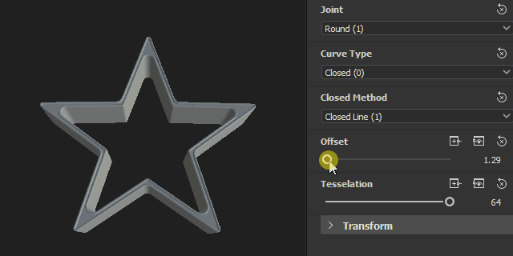

# 版本 12.3

<b>Substance 3D Designer 12.3</b>在<b>支持Substance</b>（或图形子图）以及<b>的情况下，将实例模型图形提升到一个新的水平 “ Visible if ”</b>控制公开参数和某些<b>个专用于曲线版本的新节点</b>。 此版本还引入了两个新面板（<b>欢迎</b>和<b>新增功能</b>）来改进用户入门体验，以及下面描述的一些其他次要功能或错误修复。

发行日期：*2022年10月6日*

{width="1111px"}

## 主要功能

### 在Substance模型图中对图形实例的支持

如果您习惯于创建图形，则希望能够创建子图（或图形实例）以便重复使用您的工作，使图形不那么杂乱并提高效率。\
现在也可对Substance模型图形执行此操作：只需将子图从浏览器拖放到主图形以将其用作实例节点。

{width="600px"}

我们还引入了Substance模型图（如输出场景）的输出节点概念。 您现在可以在图表中拥有一个或多个输出。\
当您的图形将在另一个图形中进行实例化时，每个输出将对应于一个输出图钉。

{width="600px"}

当您右键单击实例节点时，当然可以访问其引用的子图来查看或编辑它。

{width="600px"}

得益于子图和公开的参数，您可以创建复杂的资源并应用无限多种变体，如下图所示。

{width="600px"}

### Substance模型图的其他改进

* <b>对于公开的参数可见</b>\
  公开参数时，您可能希望根据其他参数的状态来隐藏或显示参数。 例如，仅当按钮打开时才会显示滑块。\
  使用<b>Visible If</b>，您可以向参数可见性添加条件，以保持简洁且功能齐全的UI。 此机制已适用于Substance图，现在已扩展到Substance模型图，当然，使用相同的语法。<b>\
  </b>

  {width="600px"}

* <b>专用于曲线版本的新节点\
  </b>此版本带来了一些专用于曲线编辑的新节点： <b>反向曲线</b>互换曲线的两端，<b>曲线细分</b>根据两种方法在段上添加更多顶点，<b>平滑曲线</b>使2D曲线上的所有角度变得平滑，最后<b>偏移曲线</b>膨胀或收缩2D曲线，如下所示。<b>

  </b>

  {width="600px"}
* <b>新建图形窗口</b>\
  <b>新建Substance模型图</b>窗口现在也可用于Substance模型图。 您可以添加自己的模板或选择默认模板，然后直接输入图形的名称，并选择图形要添加到哪个包。

  {width="600px"}

### “欢迎”和“新增功能”面板

我们引入了两个新的面板来帮助您开始使用Designer：

首先，<b>“欢迎”</b>面板 — 在您首次&#x200B;*“启动”* Designer时显示 — 提供了有关该软件及其在Substance 3D生态系统中的作用的全球概览。 然后，<b>新增功能</b>面板（在您首次运行Designer的&#x200B;*新版本*&#x200B;时显示）会快速显示此版本中引入的主要功能。

这两个面板也可以从“帮助”菜单访问。

### 杂项

* <b>公开布尔型参数的两个按钮小组件</b>\
  现在，您有了一种在Substance图表中公开布尔型参数的新方法。 除了切换按钮之外，您还可以将<b>并排按钮</b>用于自定义文本，以使布尔型参数驱动的两个不同模式更加可见。
* <b>解决高DPI屏幕的缩放问题</b>\
  在早期版本中，Designer无法正确处理在操作系统中设置的缩放系数。 如下图所示，4K显示器上以125%的缩放完美地管理着所有内容，所有字体和按钮都以一致的大小显示。\
  请注意，在此新版本中，“首选项”中的“禁用高DPI”选项已重置为&#x200B;*False*，因为此选项不再需要具有可用界面。

  {width="600px"}

* 对于Steam版本&#x200B;**，** Apple Silicon原生支持(M1 / M2)\
  Designer 12.2版是第一个完全支持基于M1或M2芯片的新型Apple机器的版本，但Steam版没有这种支持。 从现在起，所有Designer用户都可以从这些计算机上更快、更高效的体验中受益。

## 发行说明

### 12.3.0

*（2022年10月6日发布）*

**已添加：**

* [常规]入门面板欢迎新用户
* [常规]新增功能面板，用于提高新功能的可发现性
* [Substance模型]支持子图表和实例
* [Substance模型]支持显示参数的显示条件
* [Substance模型]添加对输出节点的支持
* [Substance模型]曲线偏移节点
* [Substance模型]曲线恢复节点
* [Substance模型]曲线平滑节点
* [Substance模型]曲线细分节点
* [Substance模型]移植节
* [Substance模型]更新“筛选场景”节点
* [Substance模型]在“节点”菜单中使非原子节点可发现
* [Substance模型]在实例节点的上下文菜单中添加“打开引用”操作
* [Substance模型]在可以发送到3DView的节点的上下文菜单中添加“在3DView中查看”动作
* [Substance模型]公开节点后自动显示其属性
* [Substance模型]使用Substance列表创建“新建模板模型图形”窗口
* [UI]改进2D视图和3D视图中图像存储选项的一致性
* [UI]在浏览器的上下文菜单中，将“链接> 3D网格”重命名为“链接> 3D场景”
* [UI]重置布局现在适用于所有浮动窗口
* [UI]在图形的上下文菜单中使用“在3D视图中查看输出”标签
* [库]支持非原子Substance模型图形
* [SBSAR]支持图形输出在SBSAR中的描述
* [着色器]将所有着色器的默认“镶嵌因子”值设置为1
* [UI]显示布尔型参数的双按钮构件
* [引擎]更新至版本8.6.4
* [Steam]针对Apple Silicon芯片组(Apple M1/M2)的优化构建

**已修复：**

* [UI]解决高DPI屏幕的缩放问题
* [UI]烘焙窗口中的列表中缺少“$(udim)”模板
* [UI]在屏幕右侧边框显示“节点”菜单时崩溃（仅限macOS）
* [UI] 3D视图菜单中的扩展按钮不可见
* [UI]图形工具栏的扩展菜单不完整
* [UI]还原硬范围激活后的参数构件值不正确
* [3D视图]从一个会话到另一个会话的Iray上，非默认着色器设置丢失
* [Bakers]加载带无网格场景的烘焙窗口时崩溃
* [函数]将实例复制到其引用的图形时崩溃
* [函数]修复处理节点时可能发生的崩溃
* [全球化]日语/韩语/中文中并不总是正确禁用斜体
* [图表]新MDL和Substance模型图表的回退标识符不正确
* [图形]继承的由值驱动的参数有时计算不正确
* [GraphRender]计算高分辨率图形时切换引擎时崩溃（仅限macOS）
