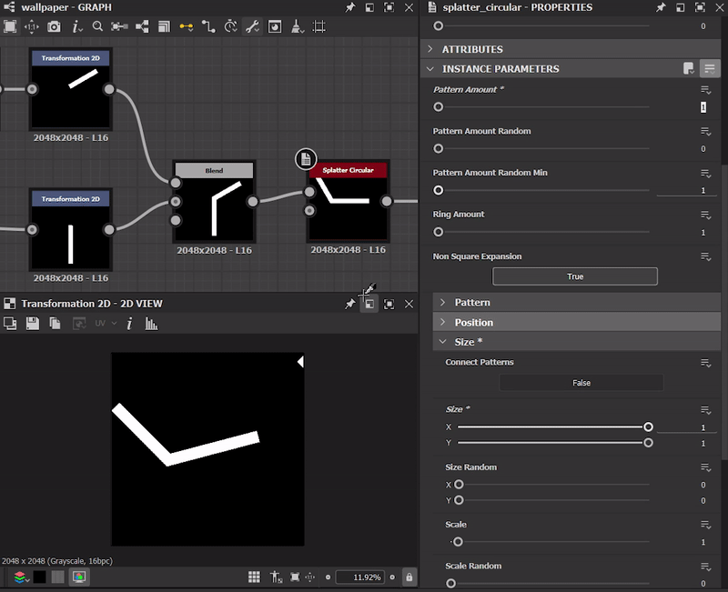
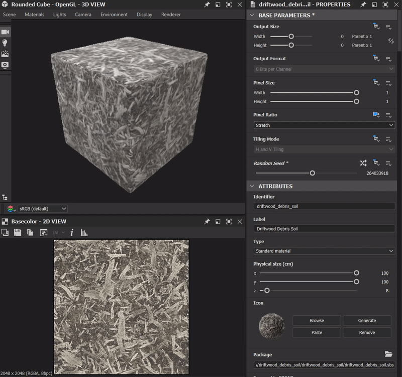
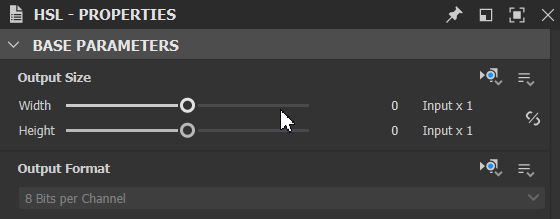
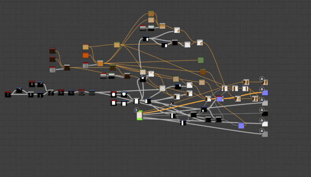

# 版本 12.4

**Substance 3D Designer 12.4**&#x200B;提供了一些生活质量改进（用于清理图表的工具、使用基本公式设置参数、用于生成随机种子的按钮、大小锁定等） 以及在Python API中支持Substance模型图表。 有关所有这些更改的更多详细信息，请参阅下文。

发行日期：*2023年1月31日*

## 生活质量改善

### 清除图形工具

在编辑图表时，有时需要尝试多种可能性，并插入/拔下各种节点，直到获得所需结果为止。 最后，图形中的一些节点未连接到输出，因此对最终结果没有影响。 此新工具将允许您自动检测并删除这些节点，以便在最终确定它们之前清理您的图表。 该清洁工具也可选择在参数函数中查找，并且可以通过图形视图工具栏中的专用按钮在当前图形上启动，或者从浏览器视图中的图形选择启动。

{width="640px"}

### 在参数字段中键入公式

当您要输入特定参数值时，无需使用计算器或再在头中进行计算。 现在，在“属性”和应用程序的其他位置中为参数设置数值时，您可以直接输入基本公式，如加法、分法、乘法或减法。

{width="640px"}

### 3D视图中的快速访问按钮

我们已在[3D视图](../../interface/3d-view/3d-view.md)中添加了一个与[显示](../../interface/3d-view/3d-view.md)菜单中所有可用选项对应的其他工具栏，以便快速访问所有这些选项（例如，线框、网格、定界框等） 按钮切换时。 我们还添加了一个用于显示/隐藏环境图的切换开关。

{width="640px"}

### 用于生成随机植入的按钮

现在，通过使用新按钮为图表生成随机种子，而不是移动滑块，您可以快速创建不同的变体。

{width="640px"}

### 锁定输出大小构件

您现在可以锁定输出大小的宽度和Height，以确保保持方形大小，并避免在每次要更新这两个值时对其进行处理。

{width="640px"}

### 将图像输入转换为彩色/灰度

通过节点上下文菜单在[输入颜色](../../compositing-graphs/nodes-reference-for-com/atomic-nodes/input/input.md)和[输入灰度](../../compositing-graphs/nodes-reference-for-com/atomic-nodes/input/input.md)之间快速切换。

{width="640px"}

### 显示渐变编辑器时，选择单击图钉

在“属性”面板中，如果单击图钉以编辑渐变，您现在将在显示的[渐变编辑器](../../compositing-graphs/nodes-reference-for-com/atomic-nodes/gradient-map/gradient-map.md)中自动选择相应的图钉。

{width="640px"}

### 选择下游节点

[节点上下文菜单](../../interface/the-graph-view/the-graph-view.md)中的新条目，用于直接或间接选择连接到所选节点输出的所有节点。 因此，您可以选择受节点影响的所有节点。 有助于删除部分图形或重工图形版面。

{width="640px"}

## Python API更新

此12.4版本还通过Python API完全支持Substance模型图。 这意味着您现在拥有了创建、编辑或评估Substance模型图所需的所有工具。 有关完整的详细信息，请查看软件帮助菜单中的文档。

## 发行说明

### 12.4.0

*（2023年1月24日发布）*

<b>已添加：</b>

* [3D 视图]添加快速访问按钮以设置显示选项（线框、环境图、场景状态等）
* [色彩管理]在ACE模式下提高烘焙3D LUT的质量
* [文档]Substance图表的示例项目
* [文档]函数图的示例项目
* [资源管理器]允许将图形和资源从一个父级移至另一个父级而不关闭或使小组件失效
* [渐变编辑器]显示渐变编辑器时，选择单击的大头针
* [图形]在节点的上下文菜单中添加选项以选择其所有子项
* [图形]清理图形工具可检测并删除所有图形类型和属性图形中未使用的节点
* [图形]将图像输入转换为彩色/灰度
* [参数]在integer2 widget上添加锁定
* [参数]允许键入基本公式作为参数
* [Substance模型]可在值和值节点的图标之间切换
* [UI]当需要随机植入时用于生成随机值的按钮
* [UI]在3D视图中高亮显示当前在场景浏览器中选定的项目
* [UX]重置滑块范围时的值时会重置滑块范围
* [API]允许向图形视图工具栏添加动作
* [API]允许从API创建/编辑/评估Substance模型图表

<b>已修复：</b>

* [3D视图]渲染器之间无法共享“正常DirectX”属性值
* [3D视图]视口较小时，场景统计信息显示会被拉伸
* [3D视图]未保存线框显示属性
* [内容]径向模糊颜色参数对Alpha通道没有影响
* [本地化]其他滑块和按钮显示在“环境OpenGL属性”中。
* [MDL]&#x200B;[Substance模型]删除公开节点时崩溃
* [Preferences]删除默认配置文件后，将不会重新创建该文件
* [Substance模型]在实例级别未显示的崩溃重新排序参数
* [API] SDProperty.getDefaultValue()几乎始终返回None
