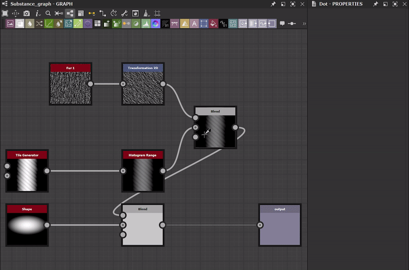

# 版本 13.0

Substance 3D Designer的这个13.0.0版本为素材艺术家带来了很多爱，具有大量新节点，Substance 引擎9.0首次引入循环，并添加了图表的强大功能：门户节点。 为了取悦更多用户，我们引入了全新的主屏幕并提供更多语言。

如前一版本中所述，此版本不再支持Substance模型图表：这意味着您无法再在Designer中打开、编辑或导出此类图表。 您可以在我们的社区论坛上的此[帖子](https://community.adobe.com/t5/substance-3d-designer-discussions/substance-model-graphs-end-of-life/td-p/13693731)中找到我们做出此决定的所有原因。

*发行日期：2023年6月6日*

*[Celine Dameron](https://www.artstation.com/cline)*&#x200B;的作品

## 新内容

这个13.0版本带来了许多新内容。 主要可以找到两个新的节点集合：“样条曲线工具”和“路径”工具。

* [样条曲线工具](../../compositing-graphs/nodes-reference-for-com/node-library/spline-paths-tools/spline-tools/spline-tools.md)是一个节点集合，用于生成和调整样条，以及使用这些节点进行映射、散布或变形图像。
* [路径工具](../../compositing-graphs/nodes-reference-for-com/node-library/spline-paths-tools/path-tools/path-tools.md)是另一组节点，它们以线段列表的形式从蒙版中提取轮廓，然后对其进行编辑和改进。

所有这些节点都将提供许多可能性，而且肯定会有许多创意应用程序。 查看有关[使用路径和样条曲线工具](../../compositing-graphs/nodes-reference-for-com/node-library/spline-paths-tools/working-with-path-and-spl/working-with-path-and-spline-tools.md)的部分，了解要了解的重要概念，以便熟悉此工具集。

*[Louise Melin](https://www.artstation.com/troglodette)*&#x200B;的作品

### 样条曲线工具

专用于样条的新节点可以分为四类：

#### 创建

当然，第一类是生成样条的种类：

* [样条三次](../../compositing-graphs/nodes-reference-for-com/node-library/spline-paths-tools/spline-tools/spline-cubic/spline-cubic.md)：从两点和两个切线；
* [样条多边形二次](../../compositing-graphs/nodes-reference-for-com/node-library/spline-paths-tools/spline-tools/spline-poly-quadratic/spline-poly-quadratic.md)：从一组点开始；
* [样条圆](../../compositing-graphs/nodes-reference-for-com/node-library/spline-paths-tools/spline-tools/spline-circle/spline-circle.md)：跟随一个圆形。

您还可以在样条之间创建<b>桥</b>，以便在[2个样条](../../compositing-graphs/nodes-reference-for-com/node-library/spline-paths-tools/spline-tools/spline-bridge-2-splines/spline-bridge-2-splines.md)或[N个样条](../../compositing-graphs/nodes-reference-for-com/node-library/spline-paths-tools/spline-tools/spline-bridge-list/spline-bridge-list.md)之间有一组完整的样条。

<table>
<tr style="border: 0;">
<td style="border: 0;" valign="top">

</td>
<td style="border: 0;" valign="top">

</td>
<td style="border: 0;" valign="top">

</td>
<td style="border: 0;" valign="top">

</td>
</tr>
</table>

#### 汇编

在某些情况下，必须将多个样条视为单个图元，因此需要工具来管理一组样条。 利用[样条合并列表](../../compositing-graphs/nodes-reference-for-com/node-library/spline-paths-tools/spline-tools/spline-merge-list/spline-merge-list.md)，可通过按顺序连接各端点，将所有样条合并为单个样条，[样条附加](../../compositing-graphs/nodes-reference-for-com/node-library/spline-paths-tools/spline-tools/spline-append/spline-append.md)节点可将样条列表附加到另一个列表中，借助[样条选择](../../compositing-graphs/nodes-reference-for-com/node-library/spline-paths-tools/spline-tools/spline-select/spline-select.md)节点，可从给定列表中筛选和选择特定样条。

#### 修改

我们还提供工具来重新处理和调整您的样条。 您将找到一个节点来应用[2D变换](../../compositing-graphs/nodes-reference-for-com/node-library/spline-paths-tools/spline-tools/spline-2d-transform/spline-2d-transform.md)，例如旋转、平移、缩放，还有一个节点用于[变形](../../compositing-graphs/nodes-reference-for-com/node-library/spline-paths-tools/spline-tools/spline-warp/spline-warp.md)<b> </b>形状和其他两个节点以修改[Thickness](../../compositing-graphs/nodes-reference-for-com/node-library/spline-paths-tools/spline-tools/spline-sample-thickness/spline-sample-thickness.md)<b> </b>或样条的[Height](../../compositing-graphs/nodes-reference-for-com/node-library/spline-paths-tools/spline-tools/spline-sample-height/spline-sample-height.md)。

<table>
<tr style="border: 0;">
<td style="border: 0;" valign="top">

</td>
<td style="border: 0;" valign="top">

</td>
<td style="border: 0;" valign="top">

</td>
<td style="border: 0;" valign="top">

</td>
</tr>
</table>

#### 渲染图像

最后一个类别是基于样条创建最终形状或图案的类别。 您首先想到的是沿样条重复给定的形状：[样条上的散点](../../compositing-graphs/nodes-reference-for-com/node-library/spline-paths-tools/spline-tools/scatter-on-spline-color/scatter-on-spline-color.md)节点允许您重复此操作，它包含许多参数来完美控制分布（旋转、缩放、偏移、颜色、蒙版等）。

多亏了[样条填充](../../compositing-graphs/nodes-reference-for-com/node-library/spline-paths-tools/spline-tools/spline-fill/spline-fill.md)<b> </b>节点，您可以轻松地从闭合样条创建图案。 如果要将任何纹理映射到样条上，并且要高度控制和精确地进行映射，则可以使用[样条映射器](../../compositing-graphs/nodes-reference-for-com/node-library/spline-paths-tools/spline-tools/spline-mapper-color/spline-mapper-color.md)节点！

<table>
<tr style="border: 0;">
<td style="border: 0;" valign="top">

</td>
<td style="border: 0;" valign="top">

</td>
<td style="border: 0;" valign="top">

</td>
<td style="border: 0;" valign="top">

</td>
</tr>
</table>

### 路径工具

[路径蒙版](../../compositing-graphs/nodes-reference-for-com/node-library/spline-paths-tools/path-tools/mask-to-paths/mask-to-paths.md)节点允许您以段列表的形式提取灰度图案的边框。

然后，您可以使用[路径2D变换](../../compositing-graphs/nodes-reference-for-com/node-library/spline-paths-tools/path-tools/path-2d-transform/path-2d-transform.md)或[路径变形](../../compositing-graphs/nodes-reference-for-com/node-library/spline-paths-tools/path-tools/paths-warp/paths-warp.md)节点处理这些路径，以便根据需要进行调整。  借助[样条路径](../../compositing-graphs/nodes-reference-for-com/node-library/spline-paths-tools/path-tools/paths-to-spline/paths-to-spline.md)节点，您可以将路径转换为样条，从而利用先前提及的样条专用的所有节点，如散布。

<table>
<tr style="border: 0;">
<td style="border: 0;" valign="top">

</td>
<td style="border: 0;" valign="top">

</td>
<td style="border: 0;" valign="top">

</td>
<td style="border: 0;" valign="top">

</td>
</tr>
</table>

为了帮助您了解所有这些新节点，我们发布了两个新的教程：

* [样条节点简介](https://www.adobe.com/go/designer-tutorial-splines)
* [路径节点简介](https://www.adobe.com/go/designer-tutorial-paths)

## 新Substance 引擎v9

上面列出的所有新节点均基于新Substance 引擎版本，并且它们充分利用了其主要的新功能： <b>循环</b>。

循环只能在[Substance函数图形](../../function-graphs/function-graphs.md)中使用，并且您最有可能在[像素处理器](../../compositing-graphs/nodes-reference-for-com/atomic-nodes/pixel-processor/pixel-processor.md)、[Fx-Map](../../compositing-graphs/nodes-reference-for-com/atomic-nodes/fx-map/fx-map.md)或[值处理器](../../compositing-graphs/nodes-reference-for-com/atomic-nodes/value-processor/value-processor.md)中实现它们。 当然，循环允许您轻松多次重复某个功能，直到满足某一条件为止。 这有助于大幅调亮您的图表，并提高准确性。

此专用的[教程](https://www.youtube.com/watch?v=Ggoy8G90oDI)将帮助您开始使用循环。

Substance 引擎v9还可带来以下改进：

* [渐变图](../../compositing-graphs/nodes-reference-for-com/atomic-nodes/gradient-map/gradient-map.md)节点的渐变编辑器中的新纯色模式（即完全无插值）
* Substance函数图中的Atomic pow()节点
* 在Sampler节点中添加边框环绕选项（固定到边缘，重复）
* [变形](../../compositing-graphs/nodes-reference-for-com/atomic-nodes/warp/warp.md)和[方向变形](../../compositing-graphs/nodes-reference-for-com/atomic-nodes/directional-warp/directional-warp.md)节点中的最近采样

## 门户节点

[门户](../../interface/the-graph-view/graph-items/graph-items.md)节点是[点](../../interface/the-graph-view/graph-items/graph-items.md)节点的新扩展，可以隐藏图中的连接。

得益于此功能，您可以通过隐藏超长连接来提高图表的可读性，还可以从图表中的任何位置快速访问关键节点。

此专用[教程](https://www.adobe.com/go/designer-tutorial-portals)中完整地说明了此新功能。

## 主屏幕

当您启动Designer时，您知道可以像访问其他Adobe产品一样访问全新的[主屏幕](../../interface/home-screen/home-screen.md)。 在此屏幕中，您可以：

* 快速创建新图表；
* 查看最近在Designer中打开的所有文件的列表，其中有一些详细信息，例如大小、上次修改它的日期或完整的文件路径；
* 学习页面，您可以在其中找到学习资源的链接，例如向您介绍新功能或发现快速提示的教程；
* 指向新增功能屏幕、关于屏幕、Substance 3D网站、支持社区论坛等的直接链接。

## 新语言

此版本提供三种附加语言：

* 西班牙语（西班牙）；
* 意大利语（意大利）；
* 葡萄牙语（巴西）。

温馨提示，如果要更改Designer中的语言，只需转到[首选项](../../interface/preferences-window/preferences-window.md)，即可在“常规”部分中找到所有可用语言的列表。

## 发行说明

### 13.0.0

*（2023年6月6日发布）*

### 已添加

* [Graph]门户节点
* [用户引导]全新“主页”屏幕
* [内容]样条（三次）节点
* [内容]样条（多边形二次）节点
* [内容]样条圆节点
* [内容]点列表节点
* [内容]样条桥（2样条）节点
* [内容]样条桥（列表）节点
* [内容]样条附加节点
* [内容]样条选择节点
* [内容]样条合并列表节点
* [内容]样条2D变换节点
* [内容]样条变形节点
* [Content] Spline SampleHeight节点
* [Content] Spline SampleThickness节点
* [内容]样条渲染节点
* [内容]样条颜色散点上的节点
* [内容]样条灰度节点上的散点
* [内容]样条映射器颜色节点
* [内容]样条映射器灰度节点
* [内容]样条桥映射器颜色节点
* [内容]样条桥映射器灰度节点
* [内容]样条流映射器节点
* [内容] UV映射器颜色节点
* [内容] UV映射器灰度节点
* [内容]指向Splines节点的路径
* [内容]将蒙版粘贴到路径节点
* [内容]路径2D变换nodenode
* [内容]路径多边形节点
* [内容] “预览路径”节点
* [内容]路径变形节点
* [内容]路径选择节点
* [内容]路径顶点处理器节点
* [内容]路径顶点处理器简单节点
* [Content] Quad Transform on Path节点
* [内容]光线跟踪环境遮蔽v2
* [内容]光线跟踪弯曲法线v2
* [内容]光线追踪阴影v2
* [引擎]更新到版本9
* [Engine]函数图中的循环节点
* [引擎]向渐变添加纯色模式
* [Engine]函数图中的Atomic pow()节点
* [引擎]在Sampler节点中添加边框环绕选项（固定到边缘/重复）
* [引擎]变形和方向变形节点中的最近采样
* [引擎]向锐化滤镜中添加“穿透Alpha”模式以用于颜色输入
* [引擎] FxMap：半球形态图
* [Engine]函数图表中的原子Get/Set操作
* [Engine]功能：使用log/log2/exp的精确功能，2pow — 统一炊具和引擎之间的功能
* [引擎]向方向变形滤镜添加“强度偏移”参数
* [API]支持预设管理以合成图表
* [函数]更改函数原子节点的输入名称
* [本地化]添加葡萄牙语（巴西）、意大利语（意大利）和西班牙语（西班牙）语言
* [本地化]遵循语言列表中的规则“语言（国家/地区）”
* [预设]使用上下文编辑时，禁用图形属性中的“预览”和“预设”面板
* [Substance模型图]停止支持Substance模型图

### 修复

* [3D视图]场景统计信息中长字符串的显示被截断（仅限macOS）
* [API] “structure：：Structure”模块仍包含在API参考中
* [API] MDL图表中的点节点既没有定义，也没有属性
* [API]设置函数节点的参数时行为不正确
* [内容] 3D Voronoi和3D Voronoi Fractal节点生成烹饪警告
* [引擎] “强度映射偏移”参数对SSE2引擎中的灰度数据没有影响
* [Explorer]可以删除图形i/o
* [Graph]在实例中使用时忽略位图
* [Graph]从节点创建节点时，点节点位置不正确
* [图表]使用“Enter”键时，“Expose参数”对话框中的焦点不正确
* [Graph]在上下文编辑中用位图扫描直方图时出现错误结果
* [本地化]修复各种剪切问题
* [参数]删除输入参数时崩溃
* [Publish]文件夹中的图表被移至已发布包中的根目录
* [资源]更新磁盘上加载的资源时崩溃
* [VisibleIf]修复条件可见性评估中的回归问题
