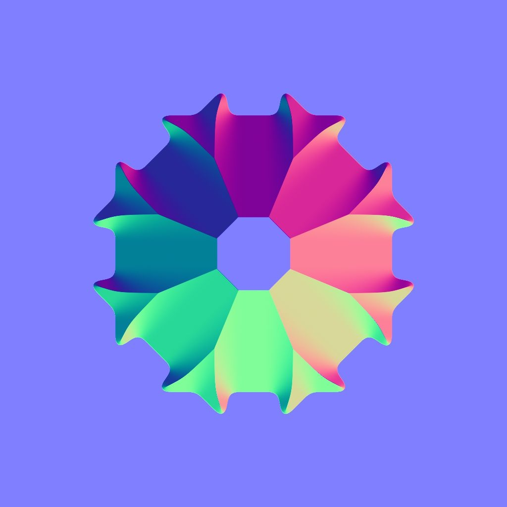

# 版本 14.0

<b>Substance 3D Designer 14.0 </b>提供了一些生活质量改进（图形导航、性能……） 但最重要的是，它包括许多新节点（颜色处理、科威特滤镜、直方图工具、斜面平滑、方向距离...）。 有关所有这些更改的更多详细信息，请参阅下文。

*发行日期：2024年7月30日*

## 新内容

此14.0版本通过下面列出的新节点提供了许多新内容：

* <b>专用于颜色处理的节点： </b>一个节点<b>（</b>[量化颜色](../../compositing-graphs/nodes-reference-for-com/node-library/filters/adjustments/quantize-color/quantize-color.md)<b>） </b>到<b> </b>减少图像中的颜色数量并从中提取调色板，这是一系列工具节点，用于构建您自己的调色板（[视图](../../compositing-graphs/nodes-reference-for-com/node-library/filters/adjustments/view-color-palette/view-color-palette.md) / [创建](../../compositing-graphs/nodes-reference-for-com/node-library/filters/adjustments/create-color-palette-16/create-color-palette-16.md) / [修改](../../compositing-graphs/nodes-reference-for-com/node-library/filters/adjustments/modify-color-palette/modify-color-palette.md)<b>） </b>调色板)以及使用ID映射将其应用于其他图像的调色板（[应用调色板](../../compositing-graphs/nodes-reference-for-com/node-library/filters/adjustments/apply-color-palette/apply-color-palette.md)）。 您还将找到用于遮盖灰度的[ID](../../compositing-graphs/nodes-reference-for-com/node-library/filters/adjustments/id-to-mask/id-to-mask.md)节点，以便将ID映射（由Quantize颜色计算）转换为灰度蒙版。 有了这整套节点，您就拥有了使用颜色创建风格化效果所需的一切。

{zoomable="yes"}

{zoomable="yes"}

* <b>Kuwahara滤镜</b>：如果您想进一步进行风格化处理，可以使用[各向异性Kuwahara颜色](../../compositing-graphs/nodes-reference-for-com/node-library/filters/effects/anisotropic-kuwahara/anisotropic-kuwahara.md)/[灰度](../../compositing-graphs/nodes-reference-for-com/node-library/filters/effects/anisotropic-kuwahara-gra/anisotropic-kuwahara-grayscale.md)滤镜生成一些绘画效果。 在细节上，应用与图像细节相符的各向异性方向模糊。 结果是一个看起来像顺着形状内部方向流动的图像。

这些节点（“量化颜色”和“各向异性”Kuwahara）将在[本教程](https://www.adobe.com/go/designer-tutorial-quantize)中介绍。 它展示了如何使用它们来设置素材样式，以及更有效、更直观地处理颜色！

其他强大的节点也加入进来：

* [<b>曲率平滑</b>](../../compositing-graphs/nodes-reference-for-com/node-library/filters/effects/curvature-smooth/curvature-smooth.md)：此新版本现在可正确支持所有拼贴模式，添加两个新输出（凸度和凹度），并提高了准确性和性能。
* <b>[直方图均衡](../../compositing-graphs/nodes-reference-for-com/node-library/filters/adjustments/histogram-equalize/histogram-equalize.md)：</b>此节点通过调整值来均衡灰度图像的直方图，以获得均衡分布。 此节点附带两个伴随节点：[直方图渲染](../../compositing-graphs/nodes-reference-for-com/node-library/filters/adjustments/histogram-render/histogram-render.md)以输出图像的直方图和[直方图计算](../../compositing-graphs/nodes-reference-for-com/node-library/filters/adjustments/histogram-compute/histogram-compute.md)<b> </b>将直方图编码为像素行。
* <b>[斜面平滑](../../compositing-graphs/nodes-reference-for-com/node-library/filters/effects/bevel-smooth/bevel-smooth.md)：</b>得益于此渐变，您可以从蒙版的边界（向外、向内或两者）绘制渐变或平面颜色。 节点[方向距离](../../compositing-graphs/nodes-reference-for-com/node-library/filters/effects/directional-distance/directional-distance.md)<b> </b>也绘制渐变，但方向是特定的。
* <b>[Normal uncombine](../../compositing-graphs/nodes-reference-for-com/node-library/filters/normal-map/normal-uncombine/normal-uncombine.md)：</b>此节点与[Normal combine](../../compositing-graphs/nodes-reference-for-com/node-library/filters/normal-map/normal-combine/normal-combine.md)节点相反，它从正常映射中删除由Height映射描述的曲面细节。

<table>
<tr style="border: 0;">
<td style="border: 0;" valign="top">

曲率平滑

<table>
  <tr>
    <td>
      
       <i>之前</i>
    </td>
    <td>
      
       <i>之后</i>
    </td>
  </tr>
</table>

</td>
<td style="border: 0;" valign="top">

直方图均衡

<table>
  <tr>
    <td>
      
       <i>之前</i>
    </td>
    <td>
      
       <i>之后</i>
    </td>
  </tr>
</table>

</td>
</tr>
</table>

<table>
<tr style="border: 0;">
<td style="border: 0;" valign="top">

斜面平滑

<table>
  <tr>
    <td>
      
       <i>之前</i>
    </td>
    <td>
      
       <i>之后</i>
    </td>
  </tr>
</table>

</td>
<td style="border: 0;" valign="top">

正常取消合并

<table>
  <tr>
    <td>
      
       <i>之前</i>
    </td>
    <td>
      
       <i>之后</i>
    </td>
  </tr>
</table>

</td>
</tr>
</table>

## 生活质量改善

* 在处理大型项目时，<b>性能</b>和<b>响应性</b>得到了改进。 例如，删除节点的速度最多可提高75倍。 对于引用了多次相同位图的图表，[烹饪](../../glossary/glossary.md)的时间也减少了。
* <b>继承的参数</b>：当参数为[继承](../../glossary/glossary.md)时，我们不再显示默认值，而是显示继承的值，以便您了解当前使用的值。 在[此文档专用页面](../../compositing-graphs/inheritance-compositing/inheritance-in-substance-compositing-graphs.md)中了解有关继承的更多信息。
* macOS上的<b>触控板支持</b>已彻底改良，更加自然，并与其他软件保持一致。 为了在所有操作系统上实现更流畅、更一致的操作，还重新考虑将节点移到[图形视图](../../interface/the-graph-view/the-graph-view.md)边框之外。

* <b>2D视图： </b>在[2D视图](../../interface/2d-view/2d-view.md)中启用拼贴显示时，现在即使对于不在原始拼贴上的像素，也可以获取值：这有助于更好地检查[取样](../../glossary/glossary.md)以及拼贴之间的值过渡。

{width="320px" zoomable="yes"}

* <b>渐变映射</b>：使用鼠标中键单击将所有[渐变键](../../compositing-graphs/nodes-reference-for-com/atomic-nodes/gradient-map/gradient-map.md)向左或向右移动（从而保留所有键之间的所有间隙）。
* <b>参数</b>：为了通过参数插入自定义函数，现在可以使用“编辑”函数构件。 这是创建自定义工具的强大解决方案，您可使用[Substance函数图形](../../function-graphs/the-function-graph/the-function-graph.md)在自定义工具中驱动参数。

<table>
<tr style="border: 0;">
<td style="border: 0;" valign="top">

{zoomable="yes"}

</td>
<td style="border: 0;" valign="top">

{zoomable="yes"}

</td>
</tr>
</table>

## API改进

脚本API包括四种新方法：

* 获取和设置Substance合成图的图表类型的方法： myGraph.setGraphType(&quot;newType&quot;) ； myGraph.getGraphType()
* 在其编辑器中打开包资源的方法（例如，“图形视图”中的Substance图形）：myUIManager.openResourceInEditor(myResource)
* 在资源管理器中选择包资源的方法（例如，Substance图形）：myUIManager.setExplorerSelection(myResource)
* 在图形视图中构造特定节点的方法：myUIManager.focusGraphNode(myGraphViewID， myNode)

## VFX平台要求

每年，[VFX参考平台](https://vfxplatform.com/)都会发布VFX行业每个软件中使用的工具和库版本列表，以最大限度地减少软件之间的不兼容问题。 像往常一样，我们&#x200B;*更新所有依赖项*&#x200B;以遵守所有这些建议。

请注意，这些更新会产生两大后果：

* <b>Linux要求</b>已更改，Designer现在要求RHEL版本8或9（不再支持CentOS）。 在[系统要求](../../getting-started/system-requirements/system-requirements.md)页面中可以找到所有详细信息。
* <b>Designer的增效工具必须</b>更新，因为某些功能在Qt6中已弃用。 您将在[社区论坛](https://community.adobe.com/t5/substance-3d-designer-discussions/plugins-required-updates-in-designer-14-0/td-p/14768559)中找到更新插件所需的全部信息。

## 发行说明

### 14.0.0

*（2024年7月30日发布）*

### 已添加

* [内容]新型各向异性Kuwahara滤波器
* [Content]新建斜面平滑节点
* [内容]新曲率平滑v2节点
* [Content]新建方向距离节点
* [内容]新的直方图工具：计算、色调均化、渲染
* [内容]新ID到蒙版节点
* [内容]新的“正常”取消组合节点
* [内容]新的Palette节点：创建、应用、修改、查看
* [内容]新的Quantize颜色节点
* [内容]非均匀方向变形：将默认强度映射值设置为1
* [内容]向具有这些版本的所有节点标签添加“颜色”或“灰度”后缀
* [内容]弃用“白噪声”仅保留“白噪声快速”
* [Content]已弃用Substance函数图表中的“Negate Float1”节点
* [内容]将“Quantize Color”重命名为“Quantize Color (Simple)”
* [2D视图]在“信息”面板中显示超出0-1范围的像素的值
* [Engine]&#x200B;[Text]对某些字体进行了新的字距调整
* [图形]在使用上下文版本时缩短编辑深度子图时的失效时间
* [链接器]在SBSASM中不要复制位图
* [参数]为所有输入参数类型添加新的“函数”构件
* [属性]改进继承参数的显示
* [UX]改进对触控板的支持（仅限Mac）
* [UX]选择时达到图形边框时实现平移现代化
* [UX]删除“禁用高DPI”功能
* [品牌推广]“启动画面”和“关于”窗口的全新品牌推广
* [渐变映射]添加移动所有键和循环的方法
* [Library]将所有默认筛选器切换到句子大小写
* [API]添加在“图形视图”视窗中框住特定节点的方法
* [API]添加用于在其编辑器中打开包资源的方法（例如，“图表视图”中的Substance图表）
* [API]添加在浏览器中选择包资源的方法（例如，Substance图）
* [API]添加用于获取和设置Substance合成图表的图表类型的方法
* [第三方]遵循2023 VFX平台建议
* [第三方]遵循2024 VFX平台建议
* [第三方]更新升级到1.82.0 + USD到23.08
* [第三方]将NGL更新到1.38
* [第三方]将OpenColorIO更新到2.3.x
* [第三方]将OpenExr更新到3.2.x
* [第三方]将OpenSubdiv更新到3.6.x
* [第三方]将Python更新到3.11.x
* [第三方]将Qt更新为6.5.x
* [第三方]将gcc更新到11.2.1
* [第三方]将glibc更新到2.28
* [第三方]将libstdc++ ABI更新为C++11 one
* [文档]新的“术语表”页面

### 修复

* [Bakers]在重新生成文件名已更改的场景时崩溃
* [Bakers]将Bakers预设存储到JSON文件时崩溃
* [内容]“样条上的散点”：公开输入图像Alpha参数
* [Content] &#39;Tile Sampler Color&#39;：缺少visibleif表达式
* [内容]各向异性杂色：X/Y量的负值生成错误结果
* [Content]各向异性噪声：使用奇值作为X量且没有Smoothness时会出现拼贴问题
* [Content] Normal Distrib函数：错误放置的max()可能会导致NaN
* [内容] RTAO、Bent Normal和RT Shadow在某些平台上无法正常工作
* [内容]形状飞溅混合颜色：OpenGL正常映射未正确混合
* [Content]节点标签中“Multi”前缀后的空间不适当
* [依赖项]在包内或包间移动图表时崩溃
* [引擎]影响斜率模糊节点的变形节点出现精度错误
* [引擎] SD中的SBSAR层无法读取内容大于2GB的SBSASM
* [函数图表] 0^n的结果不正确
* [图形] “显示节点大小”选项标记错误
* [Graph]将父注释复制到另一个图表时崩溃
* [图形]按住Alt键并拖动点节点时冻结
* [Graph]节点搜索在某些情况下可能会丢失明显的匹配项
* [Graph]编辑在打开supergraph的情况下实例化了多次的函数图表时出现性能问题
* [图表]创建输出时无效项过多
* [安全性] ICO解析越界写入漏洞
* [安全性]弃用某些未使用的图像格式
* [参数]位图PKG资源路径不可编辑
* [参数]修复与公开/批量公开值处理器参数相关的问题
* [参数]批量公开时忽略字符串参数
* [属性]编辑打开属性后实例化多次的函数图表时出现性能问题
* [SVG]对形状的编辑未应用于栅格化图像
* [UI]修复可滚动构件的一些错误/不一致问题（仅限Windows）
* [UI]导入/导出列表中3D场景文件格式的顺序不一致
* [UI]窗口操作在UI中重复
* [版本控制] “perforce.py”脚本在Python 3上不起作用
