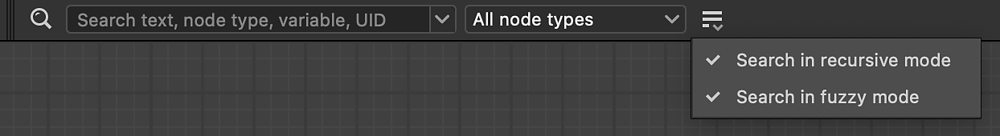
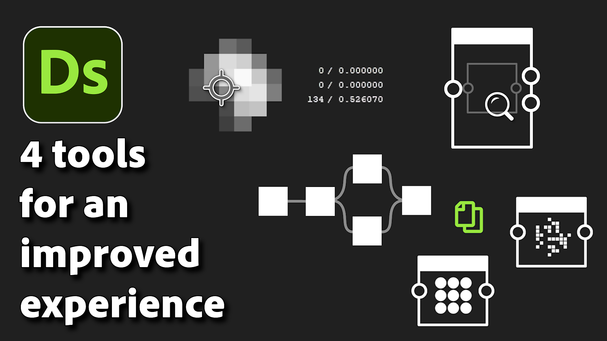

# 版本14.1

此更新引入了一些新增功能，可增强您对Substance 3D Designer的日常使用：节点排列工具可快速改进图形布局，复制/粘贴参数可将一组参数应用于另一个节点，2D视图中的像素图钉可在调试图形时跟踪特定像素。 还增加了新的内容，主要是完成样条和路径节点集。

*发行日期：2025年1月14日*

## 样条和路径更新

13.0版中引入了样条和路径节点，并且根据您的反馈，我们进行了一系列初始改进。 首先，我们添加了[散点样条在样条上](../../compositing-graphs/nodes-reference-for-com/node-library/spline-paths-tools/spline-tools/scatter-splines-splines/scatter-splines-on-splines.md)节点，它沿着父样条分布样条，提供类似于常规散点节点的选项。 此外，[路径蒙版](../../compositing-graphs/nodes-reference-for-com/node-library/spline-paths-tools/path-tools/mask-to-paths/mask-to-paths.md)节点已得到增强，以便更好地控制路径上第一个顶点的位置。 在[样条桥列表](../../compositing-graphs/nodes-reference-for-com/node-library/spline-paths-tools/spline-tools/spline-bridge-list/spline-bridge-list.md)节点中引入了随机性。

<table>
<tr style="border: 0;">
<td style="border: 0;" valign="top">

{zoomable="yes"}

</td>
<td style="border: 0;" valign="top">

{zoomable="yes"}上散点样条

</td>
</tr>
</table>

## 节点对齐工具

如果您希望保持干净易读的图表，则[节点对齐工具](../../interface/the-graph-view/node-alignment-tools/node-alignment-tools.md)是为您制作的，并且已经完全改版！ 现在可以均匀地分布节点（水平或垂直），对齐节点通过整齐地栈叠节点可避免任何重叠。 最上面的樱桃：这两种功能都考虑到了节点的实际大小！

{zoomable="yes"}

## 复制/粘贴参数

现在可以[复制一个节点的参数并将其粘贴到另一个](../../compositing-graphs/manage-parameters/manage-parameters.md)上，因此目标节点中的所有匹配参数都将更新为源节点的值。 例如，如果您要将颜色节点的参数转移到其灰度版本，或者反之，这将非常有用。 （例如，“平铺Sampler”节点）

## 在 2D 视图中钉住像素

2D视图中新的[彩色Sampler工具](../../interface/2d-view/color-sampler/color-sampler.md)可让您通过放置一个图钉来跟踪选定像素的值。 这对于确保您始终跨图形中的多个节点查看同一像素的信息非常有用。 打开“信息”面板以访问该工具，然后试用一下！

{width="640px" zoomable="yes"}

## 搜索改进

[节点查找器](../../interface/the-graph-view/node-finder/node-finder.md)工具已稍有改进：

* 您现在可以启用递归模式以进行更深入的搜索；
* 如果要搜索确切的词语，则可以禁用模糊模式；
* 启用节点查找器工具时，自动在搜索字段上设置焦点；
* 重新考虑了工具栏的布局，以节省空间。

{width="640px"}

## 视频

<table>
<tr style="border: 0;">
<td style="border: 0;" valign="top">

</td>
<td style="border: 0;" valign="top">

</td>
</tr>
</table>

## 发行说明

### 14.1.0

*（2025年1月14日发布）*

### 已添加

* [2D视图]在“信息”面板中添加固定像素显示
* [API]在“图形视图”场景中显示节点框大小
* [Content] “素材Height混合”：添加“Height蒙版”输出
* [Content] “Path Vertex Processor”：对“逐顶点函数”参数使用“编辑函数”按钮
* [内容]自动色阶：清理未使用的参数，调整标签和工具提示
* [内容]路径蒙版v2
* [内容]新的最小方差节点均值(MLV)
* [内容]新建中间值筛选器节点
* [内容]量化颜色：添加“最接近”筛选选项
* [内容]样条桥列表：添加随机样条偏移参数
* [内容]样条曲线工具：新样条（二次）节点
* [内容]Triangle Grid：更改三角化方法和使用循环
* [Content] Splines节点上的新散点样条
* [Cooker]将“像素比率”基本参数公开为“$pixelratio”静态变量
* [崩溃报告]集成新的崩溃报告窗口
* [引擎]添加混合引擎的Vulkan/Metal版本
* [图形]材质模式：选择单个链接时允许不使用任何方式连接输入
* [图形]材质链接：连接不模糊时允许标准连接
* [图表]节点对齐工具：添加水平/垂直分布、左/右/上/下对齐，并支持栈叠节点
* [库]修复上下文菜单中的文本颜色
* [参数]将参数从一个节点复制到另一个节点
* [属性] “全部重置”：删除确认弹出窗口
* [资源]在“链接位图”对话框中，将格式设置为“所有格式”
* [搜索]添加启用/禁用递归模式的方法
* [搜索]添加启用/禁用模糊搜索的方法
* [搜索]在使用节点查找器的键盘快捷键启用节点查找器时，始终显示并设置对搜索词字段的关注
* [Search]重做筛选器选项
* [快捷键]允许分配“V”、“H”和“S”键
* [第三方]升级到Qt 6.5.7
* [UX]模态对话框不应最小化
* [UX]删除警报对话框上的水平滚动

### 修复

* [内容]斜面：法线格式不受全局首选项的影响
* [内容]“蒙版颜色”节点不会忽略Alpha
* [Content]方向距离：当输入具有垂直图像比例时，结果不正确
* [Content]Flood Fill映射器：对缺少的变量引发警告
* [Content]直方图计算：结果为预期值的16倍
* [Content] RT焦散线无法用于非方形分辨率
* [内容]样条桥列表：使用起始/结束偏移时结果不正确
* [内容]样条选择：输出样条量可以大于输入样条量
* [内容]使用SSE引擎时，“样条变形”生成黑色结果
* [Content]Triangle Grid：图案未正确平铺
* [内容]Triangle Grid：拼贴在特定情况下断开
* [数据]在特定情况下更改图形输入标识符时崩溃
* [函数图形]长值在“浮点”节点上显示重叠
* [Fx-Map]显示象限节点属性时崩溃
* [Graph] [UDIM]在UDIM列表中有一个滚动条会导致1..1 1..2个条目
* [Graph]&#x200B;[Shortcuts]复制节点后，使用快捷方式创建的节点不会放置在现有链接上
* [属性]值无效时显示的参数不正确
* [Publish]发布包时，相互依赖性导致无限循环
* [Publish]对具有已卸载依赖关系的包使用“Publish”操作时出现静默故障
* [UI] “主页大小”构件在展开时无法正确显示，并且可能会阻止界面（仅限macOS）
* [UI]在某些情况下，主窗口落后于其他应用程序（仅限Windows）
