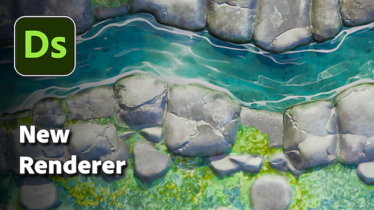

# 版本15.0

此更新带来了全新的3d渲染器，具有栅格化器和路径跟踪器模式，并且原生支持[USD](https://openusd.org/release/index.html)，允许您编辑和导出场景而不会丢失任何数据。

*发行日期：2025年7月15日*

## 新的 3D 渲染器

### 新的栅格器和路径跟踪器

此新版本允许您访问高级[3D渲染器](../../interface/3d-view/3d-renderers/3d-renderers.md)，其具有栅格化模式（在材料处理时进行实时预览）和路径跟踪器模式（光线跟踪模式可获得完美且准确的渲染）。 此新渲染器通过光栅化器模式中的阴影等功能增强功能，提高了质量和性能，并设计为支持未来技术（如[MaterialX](https://materialx.org/)）。 它对Designer中现有的OpenGL和Iray渲染器进行了补充，并与Substance 3D Viewer和Substance 3D Sampler中提供的渲染器保持一致，从而确保在整个生态系统中提供统一的体验。

[3d视图工具栏](../../interface/3d-view/3d-view.md)已更新，可快速访问此渲染器中提供的某些新功能：

* <b>选择场景：</b>以选择工具中的子网格。 选择子网格后，可以专注于子网格(F)或访问其材料属性（右键单击）。
* <b>启用路径跟踪器：</b>以在路径跟踪器和栅格化器模式之间快速切换。
* <b>启用阴影：</b>在场景中启用阴影，用于查看材料如何根据光线表现。
* <b>启用地面平面：</b>以启用或不启用场景中的地面平面。

此外，旋转环境光的热键已更改，以匹配其他Substance应用程序，因此现在它是&#x200B;*<b>按住Shift键右键单击</b>*，而不是&#x200B;*<b>按住Ctrl键并右键单击</b>*。

### 后期效果

[后期效果回来了](../../interface/3d-view/camera/post-effects/post-effects.md)！ 它们现在可通过相机菜单获取，并且已在内部开发。

* <b>开花：</b>模拟光线和反射等亮点周围的眩光，从而更好地显示emissive表面。
* <b>色调映射： </b>使用配置文件设置颜色范围，以获得高动态范围(HDR)效果。
* <b>场深度：</b>模拟相机镜头的聚焦属性（仅限栅格化器）。

## 上下文中的资源版本

处理材料时，您可能希望在特定3D 场景的上下文中[预览文档](../../working-with-3d-scenes/working-with-3d-scenes.md)。 因此，我们增加了导入和渲染完整场景及其所有纹理、相机和光照的可能性。 最重要的是，如果此场景引用MaterialX着色器，则这些着色器将使用栅格化器进行正确渲染！

导入后，您可以通过选择网格（按住SHIFT键并单击或使用“场景”浏览器）并[覆盖其任何材料](../../working-with-3d-scenes/overriding-scene-mat/overriding-scene-materials.md)来处理场景。 然后，您可以：

* 创建或载入图形并将其应用于场景材料。
* 通过[将现有材料的纹理](../../working-with-3d-scenes/extracting-materials-val/extracting-materials-values-and-textures.md)提取到新图形中，对现有进行调整。

最后，编辑3D场景后，您可以[将其导出](../../working-with-3d-scenes/exporting-scenes/exporting-scenes.md)为新文件，或导出为原始文件的新图层，以防止丢失任何数据（仅适用于USD格式）。

最后但同样重要的是，现在支持导入和导出更多3D格式：USD(+ usda、usdc、usdz)、STL、PLY和GLTF，以及已可用的格式FBX和OBJ。

## 丰富的工具提示

引入了丰富的工具提示，以更好地演示每个节点的用途。 这些工具提示目前仅适用于[原子节点](../../compositing-graphs/nodes-reference-for-com/atomic-nodes/atomic-nodes.md)，其中包含演示节点效果并提供指向文档的直接链接以获取详细信息（包括参数、提示和技巧的列表）。

<table>
<tr style="border: 0;">
<td style="border: 0;" valign="top">

</td>
<td style="border: 0;" valign="top">

</td>
<td style="border: 0;" valign="top">

</td>
</tr>
</table>

## 改进非方形支持

如果您需要使用非正方形纹理，则可以使用此新选项。 在3D视图的[材料属性](../../interface/3d-view/material-properties/material-properties.md)中，在用于控制拼贴的UV选项中，现在可以为两个轴设置其他值。

{zoomable="yes"}

## 烘焙

尽管烘焙界面仅进行了少量更新（请参阅下面的详细列表以了解更多信息），但Baker库已完全重建，以使用基于GPU的Baker，从而实现了更好的性能。 对于从事烘焙工作流程的用户来说，此更新以及上面提到的受支持的新文件格式代表着实质性的进步。

注意：如果您使用sbsbaker.exe来自动执行过程，则该工具已重命名为substance3d\_tool.exe（请使用substance3dBaker—help了解更多信息）。Baker

## VFX平台要求更新

每年，[VFX参考平台](https://vfxplatform.com/)都会发布VFX行业每个软件中使用的工具和库版本列表，以最大限度地减少软件之间的不兼容问题。 像往常一样，我们&#x200B;*更新所有依赖项*&#x200B;以遵守所有这些建议。

## 视频

## 发行说明

### 15.0.0

*（2025年7月15日发布）*

### 已添加

* [3D 视图]全新的渲染器，具有栅格化器和路径跟踪器模式
* [3D 视图]添加选择工具，以在3D 场景中选取对象
* [3D 视图]添加新的“导出包含图层的场景...” “场景”菜单中的操作
* [3D 视图]添加新工具栏按钮
* [3D 视图]添加在USD场景中包含的多个相机之间切换的可能性
* [3D 视图]在视口中按“F”时允许专注于所选对象
* [3D 视图]允许从现有材料生成Substance合成图形
* [3D 视图]允许在3D 视图中发送SBS Comp图形并将其唯一输出分配给环境/全景图使用情况
* [3D 视图]按Esc键清除当前选区
* [3D 视图]显示带有纹理的导入3D 场景
* [3D 视图]区分X和Y纹理重复控件
* [3D 视图]启用/禁用阴影
* [3D 视图]启用/禁用地面平面
* [3D 视图]在“材料”菜单中，仅对已手动添加且未使用的材料添加“删除”
* [3D 视图]在“材料”菜单中，删除“全部删除”操作
* [3D 视图]使导出的USDZ文件成为自包含文件
* [3D 视图]切换渲染器模式时，使渲染器属性永久保留
* [3D 视图]在覆盖材料时保留现有材料输入
* [3D 视图]重新排列相机属性
* [3D 视图]删除操作“相机/保存屏幕截图……” 以及“将屏幕截图相机/复制到剪贴板”
* [3D 视图]删除菜单操作“材料/全部重建”
* [3D 视图]删除默认相机标签的前缀“默认”
* [3D 视图]将菜单操作“重置为默认值”设置为材料输入属性汉堡包菜单中的最后一个操作
* [3D 视图]快捷键调整
* [3D 视图]支持实时模式的阴影和translucency
* [3D 视图]支持导入的USD场景中的MaterialX着色器
* [3D 视图/OpenGL]将“已启用UV 缩放”参数重命名为“启用图形物理尺寸”
* [3D 视图/后期效果]开花
* [3D 视图/后期效果]字段深度
* [3D 视图/后期效果]色调映射
* [3D 视图/场景浏览器]允许在SceneBrowser中选择材料属性时显示属性
* [3D 视图/场景浏览器]隐藏“材料”列
* [3D 视图/场景浏览器]将由预定义实体控制的USD图元加粗
* [Baker]在树视图中添加具有“全选”/“取消全选”操作的上下文菜单
* [Baker]添加一个选项以控制双色调插值
* [Baker]在GUI中添加水平拆分器
* [Baker]当UDIM为udim时，在输出名称中默认添加场景宏
* [Baker]允许重新计算正切
* [Baker]允许在不断开链接的情况下重命名Baker
* [Baker]更改中间面板的默认大小
* [Baker]UDIM工作流程的输入纹理
* [面包师]制作2D视图地图列表顺序匹配面包师渲染列表顺序
* [烘焙师]使烘焙窗口模态化
* [Bakers]管理色调映射参数
* [Bakers]删除相切空间增效工具选择
* [烘焙师]保存预设时，烘焙师保存状态“已启用”或“已禁用”
* [面包师]默认情况下，在选择小组件中选择素材
* [烘焙]设置法线输出纹理相对于首选项的默认方向
* [烘焙]默认情况下，将UV磁贴设置为全部
* [面包师] WordSpaceDirection添加选项FromTexture/FromValue
* [Bakers]世界到切线：将默认输入设置为“从纹理”
* [SBSBaker]创建一个选项以控制后端顺序
* [SBSBaker]改进StringList参数的使用
* [SBSBaker]将“match\_source\_instance”重命名为“match\_mesh\_name”
* [SBSBaker]将“Submesh”重命名为“GeomSubset”
* [SBSBaker]重命名为substance3d\_baker
* [内容]将“半球”形状添加到显示象限形状的生成器节点
* [Interop]支持GLTF文件格式
* [Interop]支持PLY文件格式
* [Interop]支持STL文件格式
* [库]统一原子节点的工具提示
* [Mac]停止支持MacIntel平台
* [Nodes]为原子节点添加丰富工具提示
* [Parameters]默认情况下关闭“Attributes”部分
* [Parameters]允许用户为新实例指定基本参数默认值
* [Preferences] Bakers：添加布尔选项以计算每个片段的切线空间
* [首选项]删除正切空间增效工具
* [Preferences]存储每个次要版本SD (XX.X)的首选项
* [VFX]更新提升至1.85.0
* [VFX]将MacOS最小版本更新到12.0
* [VFX]将OpenColorIO更新到2.4.2
* [VFX]将OpenColorIO更新到2.4.x
* [VFX]将OpenExr更新到3.3.x
* [VFX]将Qt更新为6.5.8

### 修复

* [3D 视图]导出的USD场景中的纹理未正确应用
* [3D 视图] [UDIM]如果在图形首选项中关闭了打开文档时自动查看，则无法在3D 视图中查看UDIM图形输出
* [Baker]“消除锯齿”和“平均” 不适用Baker的法线单元格为空白且可编辑
* [Baker]当首选项中禁用“刷新”操作时，该操作使用射线追踪后端
* [Baker]Baker在“刷新所有已烘焙贴图”过程中失败后被阻止为忙
* [Baker]在特定的网格上烘焙OpenGL位置映射时，以180+个UDIM崩溃
* [Baker]在一行中多次打开“烘焙模型信息”对话框时崩溃（仅限macOS）
* [Baker]在JSON预设导出中，“udim”值在设置为“全部”时替换为“1001”
* [Baker]在Linux上未正确检测到内存
* [Baker]缺少映射输入依赖项不会触发警告和/或块渲染
* [Baker]输出名称为空时没有错误标签
* [Baker]从文件切换高模网格不起作用
* [Baker]使用“重制”操作时，默认情况下不选择目标Baker
* [引擎]距离：在某些情况下，可见“剪切”
* [引擎] Fx-Map：当位深度为8位时，不支持负色（仅限GPU引擎）
* [本地化]节点菜单中的字符输入从日语切换回拉丁语
* [安全性] USDC文件解析超出绑定写入漏洞
* [安全性]分析NEF文件时存在外界WRITE漏洞II
* [安全性]分析DNG文件时存在越界读取漏洞III
* [首选项]只读项目的项目设置中的UX问题
* [资源]打开FBX文件时未显示多个UV集
* [UI]状态栏中的标签重叠
* [UI]不显示“链接创建模式”下拉菜单的工具提示

### 已知问题

* [烘焙师]使用某些特定的NVidia驱动程序烘焙时崩溃
* [3D视图] OpenGL：某些导入的场景可能无法渲染
* [3D视图]栅格化程序：在平面场景上使用位移时产生阴影伪影
* [3D视图]路径跟踪器：在启用镶嵌/位移的情况下更新纹理时，性能缓慢
* [3D视图]某些颜色素材属性在覆盖时未正确进行颜色管理
* [3D视图]无法正确支持带有动画基元的场景
* [3D视图]尚不支持具有多个UDims的网格
* [3D视图]不支持具有多个UV的网格，这可能会导致材质渲染无效
* [3D视图] AMD显卡不支持路径跟踪器
