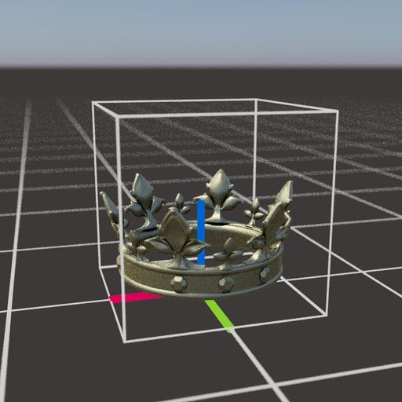
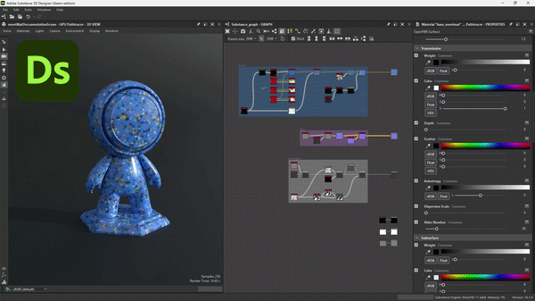
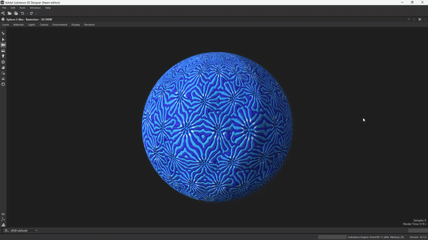

# 版本16.0

得益于新的“形状飞溅”和SDF节点，此16.0版本为图案散布和操作引入了更具创意的工作流程。 它还原生支持OpenPBR并改进了3D视图中的位移设置。

*发行日期：2026年4月14日*

## 形状飞溅v2节点

### 散布形状的新方法

新的[形状飞溅v2](../../compositing-graphs/nodes-reference-for-com/node-library/texture-generators/patterns/shape-splatter-v2/shape-splatter-v2.md)节点使用&#x200B;**更多形状分布方法**（泊松盘，一致），默认情况下是&#x200B;*无碰撞*，使用&#x200B;**密度图**&#x200B;控制特定区域形状的&#x200B;*干净集合*，从而解锁了迄今为止一直具有挑战性的复杂散射行为。\
高级用户可以设置由函数图表定义的&#x200B;*自定义分配*。

<table style="margin-top: 32px; margin-bottom: 32px">
    <tr style="border: 0">
        <td style="width: 33%; border: 0">
             <i>泊松分布</i>
        </td>
        <td style="width: 33%; border: 0">
             <i>均匀分布</i>
        </td>
        <td style="width: 33%; border: 0">
             <i>形状飞溅v2：密度图</i>
        </td>
    </tr>
</table>

### 三维形状

散布形状现在是&#x200B;**3D对象**，可在所有XYZ轴上移动、旋转和缩放。

使用&#x200B;**简单基元**，例如立方体、球面和圆柱，或通过&#x200B;*凸出Height图*&#x200B;或创作&#x200B;*3D SDF形状*&#x200B;形成的&#x200B;**复杂自定义形状**。 （下面提供了更多相关信息）

这释放出更动态、更多样化和更可信的散射。 现在可以通过翻转3D形状来改变它们的用途。 （我们看到了你，环境艺术家！）

<table style="margin-top: 32px; margin-bottom: 32px; border: none">
    <tr style="border: 0">
        <td style="width: 33%; border: 0">
             <i>随机3D旋转</i>
        </td>
        <td style="width: 33%; border: 0">
             <i>形状凸出</i>
        </td>
        <td style="width: 33%; border: 0">
             <i>3D SDF形状</i>
        </td>
    </tr>
</table>

### 伴随节点

与Shape Splatter v1节点系列类似， Shape Splatter v2自带一组配套节点。

[形状飞溅v2映射器](../../compositing-graphs/nodes-reference-for-com/node-library/texture-generators/patterns/shape-splatter-v2-mapper-color/shape-splatter-v2-mapper-color.md)节点允许在散布的3D形状上投影纹理，支持&#x200B;*三面投影*&#x200B;和&#x200B;*素材ID*&#x200B;来映射多个纹理。 可以对纹理偏移和颜色变化全局调整结果或根据形状调整结果。\
同样，高级用户可以设置由函数图表定义的&#x200B;*自定义纹理映射*。

[形状飞溅v2到蒙版](../../compositing-graphs/nodes-reference-for-com/node-library/texture-generators/patterns/shape-splatter-v2-to-mask/shape-splatter-v2-to-mask.md)为特定选区的形状和/或素材ID创建蒙版，允许在图形下游更粒度地使用形状。

<table style="margin-top: 32px; margin-bottom: 32px; border: none">
    <tr style="border: 0">
        <td style="width: 33%; border: 0">
             <i>三平面映射</i>
        </td>
        <td style="width: 33%; border: 0">
             <i>正常映射</i>
        </td>
        <td style="width: 33%; border: 0">
             <i>从SDF形状映射每个材质ID</i>
        </td>
    </tr>
</table>

### 网格图集

<table>
    <tr style="vertical-align: top; border: 0">
        <td style="border: 0">
            
自定义图案可以单独提供给形状飞溅v2节点，或打包到网格图集中以实现更精简和更高效的工作流程。

由于新<a href="../../compositing-graphs/nodes-reference-for-com/node-library/texture-generators/patterns/grid-atlas-color/grid-atlas-color.md">网格图集</a>打包，简化了节点模式。

        </td>
        <td style="text-align: right; width: 33%; margin-left: 32px; border: 0">
            
        </td>
    </tr>
</table>

### 材质样本

<table style="border: none">
    <tr style="border: none">
        <td style="border: none; vertical-align: top">
            
<b>生锈螺栓</b><a href="../../compositing-graphs/creating-compositing-gra/material-samples/material-samples.md">材质样本</a>可用于跳转形状飞溅v2系列节点及其特征。

对图形进行组织和注释以指导您了解其结构、节点设置和技术。

它也是<i>完全可编辑</i>，因此可用作沙盒，以更深入地了解“形状飞溅”v2工具集。 您可以创建任意数量的示例图表，因此请尽情使用吧！

        </td>
        <td style="border: none; width: 20%; vertical-align: top; text-align: right">
            
        </td>
    </tr>
</table>

## 3D SDF节点（带符号距离字段）

<table>
    <tr style="vertical-align: top; width: 75%; border: 0">
        <td style="border: 0">
            
Designer 16.0使用编写SDF 函数所用的大量图形目录，在函数节点中添加了生成3D形状的强大方法。

带符号的距离字段是空间表示为到数学定义的曲面的距离。 当使用各种运算符变换和组合这些曲面时，可使用它们定义越来越复杂的形状。

        </td>
        <td style="text-align: right; width: 25%; margin-left: 32px; border: 0">
            
        </td>
    </tr>
</table>

### 创作3DSDF 函数

SDF 函数涉及[新的节点系列](../../function-graphs/nodes-reference-for-fun/function-node-library/function-node-library.md#sdf-functions)，它们分为4个类别：

* **基元**&#x200B;是基本构造块，它们生成简单的可调整形状，几个控件允许您根据需要对其进行定制。
* **运算符**&#x200B;根据节点以简单或复杂的方式组合或复制形状：从简单的布尔运算符到形状、壳和对称，它们极大地扩展了可以获取哪种3D形状的可能性
* **变换**&#x200B;允许您通过弯曲、扭曲和伸长来调整形状的位置、旋转和大小（可预期且超出此范围）。
* 通过&#x200B;**材料**&#x200B;节点，您可以设置一些基本的材料属性（如材料和ID），这些属性可由[形状飞溅v2](../../compositing-graphs/nodes-reference-for-com/node-library/texture-generators/patterns/shape-splatter-v2/shape-splatter-v2.md)系列节点用于蒙版或为形状着色。

>[!INFO]
> 
> 转至[使用SDF 函数](../../function-graphs/nodes-reference-for-fun/function-node-library/function-nodes-sdf-functions/working-with-sdf-functions.md)页，开始使用这些节点。

轻量级节点具有清晰易读的图标，这使得构建3DSDF 函数比您想象的更容易，尤其是在将这个工具集添加到工具集后……

### 3D查看器节点

创作3DSDF 函数时，需要在3D空间中可视化生成的形状。 [3D查看器节点](../../compositing-graphs/nodes-reference-for-com/node-library/filters/effects/3d-viewer/3d-viewer.md)将3D SDF或交叉点函数渲染为一个3D 场景，具有可调整的相机控制、自定义环境光和支持渲染基本材料。 （色彩、粗糙度和金属质感）

该节点还包括用于详细检查生成的形状和调试问题的功能：单独渲染路径(AOV)、SDF等值线和视觉助手。 (E.g. Bbox出血着色、网格和旋转弧线)

<table style="margin-top: 32px; margin-bottom: 32px">
    <tr style="width: 50%; border: 0">
        <td style="text-align: center; width: 50%; border: 0; padding: 15px">
            
        </td>
        <td style="width: 50%; border: 0; padding: 0">
            <table>
                <tr style="vertical-align: top; border: 0">
                    <td style="text-align: center; border: 0">
                        
                    </td>
                    <td style="text-align: center; border: 0">
                        
                    </td>
                </tr>
                <tr style="vertical-align: top; border: 0; background: transparent">
                    <td style="text-align: center; border: 0; background: transparent">
                        
                    </td>
                    <td style="text-align: center; border: 0; background: transparent">
                        
                    </td>
                </tr>
            </table>
    </tr>
</table>

## OpenPBR 支持

[OpenPBR曲面](https://academysoftwarefoundation.github.io/OpenPBR/)是曲面着色模型的规范，旨在作为计算机图形的标准，能够精确建模绝大多数材料。

现在，整个应用程序都支持此材质模型，新渲染器（栅格化器、GPU 路径追踪）和OpenGL渲染器中都有[专用着色器](../../interface/3d-view/material-properties/material-properties.md#openpbr)。

使用新的图形模板开始了解这一广泛采用的行业标准，或者浏览现在基于OpenPBR的内置材料示例。

<table style="border: none; margin-top: 32px; margin-bottom: 32px">
    <tr style="vertical-align: top; border: 0">
        <td style="text-align: center; border: 0">
            
        </td>
        <td style="text-align: center; border: 0">
            
        </td>
    </tr>
</table>

现在，OpenPBR着色器是3D视图的默认值，并且通过将旧版PBR用法与OpenPBR的用法匹配，原生支持以前版本中的图形。

与现有的着色器相比，OpenPBR着色器支持更多的效果，如薄膜和薄壁。 所有效果均可在栅格化（栅格化器、OpenGL）中使用，包括最后折射！

<table style="border: none;">
    <tr style="vertical-align: top; border: 0">
        <td style="border: 0">
            使用新的<a href="../../compositing-graphs/graph-parameters/graph-parameters.md#attributes">“材质模型”属性</a>（用于Substance图表）还可以更轻松地使涉及特定着色器的工作流保持同步，该属性可确保在3D视图中查看的图表对图表的材质模型使用合适的着色器。
        </td>
        <td style="text-align: right; margin-left: 32px; border: 0">
            
        </td>
    </tr>
</table>

>[!NOTE]
> 
>该属性也包含在已发布的SBSAR文件中，以集成到您的材质工作流程中。

## 3D视图中的位移控件

现在，通过3D视图工具栏中的[新位移弹出窗口](../../interface/3d-view/displacement/displacement.md)可直接访问，可以更快、更轻松地在3D视图中调整位移和镶嵌。

调整&#x200B;**Height比例**、**Height级别**&#x200B;和&#x200B;**镶嵌**&#x200B;值，在素材属性和渲染器设置中前后不重复。

这些控件同时适用于我们的新渲染器（栅格化程序、GPU 路径追踪）和OpenGL渲染器。

如果场景包含多种材质，请按住<code>Shift以预先选择要调整的场景对象</code> 然后在场景浏览器中单击它（仅栅格化和GPU 路径追踪）或选择它。

>[!NOTE]
> 
>网格化是光栅化器和GPU 路径追踪中&#x200B;*每个对象*，以及OpenGL中&#x200B;*每个材质*。

## 其他更改

### 常量值节点

<table style="border: none; margin-top: 32px; margin-bottom: 32px">
    <tr style="vertical-align: top; border: 0">
        <td style="border: 0">
            
为了更轻松地访问Substance图中的常量值，添加了<a href="../../compositing-graphs/nodes-reference-for-com/node-library/values/constant.md">个新节点</a>以生成每种类型的简单值。

您可以在库的<b>值&gt;常量</b>部分中找到所有这些参数。

        </td>
        <td style="width: 60%; border: 0">
            
        </td>
    </tr>
</table>

### MDL图表和Iray生命周期结束

正如您在15.1版本中所收到通知的那样，现在将从Designer中删除MDL图形功能集和Iray渲染器。\
我们的内部GPU 路径追踪是Designer中高质量照片逼真渲染的首选渲染器。

Designer正逐渐退出MDL，转而使用MaterialX作为可互换的、受广泛支持的材质定义的着色语言选择。\
MaterialX在计算机图形行业中迅速获得关注，可通过美元文件传输，以实现跨DCC和渲染器的完整场景可移植性。

>[!NOTE]
> 
>MDL图表和Iray渲染器的文档可通过其[专用生命周期结束页面](../../technical-issues/mdl-graph-iray-eol/mdl-graph-iray-eol.md)获得。

### VFX平台升级和macOS最小版本

以下库已升级以符合最新的VFX平台标准：

* C++ 20
* Python 3.13
* Qt 6.8
* 增强1.88
* OpenColorIO 2.5
* OpenSubDiv 3.7
* OpenEXR3.4
* oneTBB 2022

macOS的最低支持版本要求已更新为macOS 14 Sonoma。

## 发行说明

### 16.0.0

*（2026年4月14日发布）*

### 已添加

* [内容]形状飞溅v2节点
* [内容]形状飞溅v2映射器颜色/灰度节点
* [内容]形状飞溅v2到蒙版节点
* [内容]网格图集节点
* [内容] 3D查看器节点
* [内容] 3D SDF运算符节点
* [Content] 3D SDF基本节点
* [内容] 3D SDF变换节点
* [内容] 3D SDF材质节点
* [内容]与矢量节点的角度
* [内容]常量值节点
* [3D视图] OpenGL渲染器的OpenPBR着色器
* [3D视图]用于栅格化器和OpenPBR渲染器的GPU 路径追踪着色器
* [3D视图]用于设置Height比例、Height级别和镶嵌的位移窗口
* [3D视图]重新组织工具栏项目
* [3D视图]将OpenPBR设置为3D视图中的默认材质模型
* [3D视图]让3D视图考虑“材质模型”图形属性
* [3D视图]在栅格化器/同步器和OpenGL渲染器之间切换GPU 路径追踪时材质模型
* [3D 视图]切换3D渲染器和材料定义更改时，请确保材质模型是永久性的
已同步
* [3D视图]GPU 路径追踪：启用蓝色杂色像素循环
* [3D视图]显示环境遮蔽不透明度控件
* [3D视图]为所有着色器将“拼贴”参数范围设置为[0， 10]
* [3D视图]将“焦点”操作重命名为“框架”
* [3D视图]处理替换tesselationFactor的新refineLevel参数
* [3D View]添加FPS计数器
* [3D视图]将进度条移动到与底部色彩空间相同的水平工具栏中
* [烘焙师]在预览中显示所选烘焙师的UV
* [Graph]将新的“材质模型”属性添加到Substance图表
* [NewGraph]在缩览图视图中添加分隔符
* [参数]使用“函数”编辑器为输入参数定义默认常量值
* [Parameters]使用可用变量填充`Set`和`Is defined`节点参数的组合框
* [Preferences]删除“3D 视图”选项卡中过时的“缩放系数”选项
* [Publish] Publish对话框：在图形信息中包含材质模型
* [Python]添加新类SDMaterialModelDescription以获取材质模型的信息
* [Python]允许获取/设置SDSBSCompGraph对象的材质模型属性
* [Python编辑器]将字体大小增加到12
* [模板]添加OpenPBR模板
* [模板]将材料示例转换为OpenPBR
* [第三方]更新升级到1.88版本
* [第三方]将C++ API更新为C++20
* [第三方]将NGL更新到1.42
* [第三方]将oneTBB更新到2022.x版本
* [第三方]将OpenColorIO更新到2.5.x版本
* [第三方]将OpenEXR更新到3.4.x版本
* [第三方]将Qt和QtForPython更新到6.8.x，将Python更新到3.13.x
* [第三方]将TBB更新为oneTBB 2021.x
* [弃用]删除Iray和MDL编辑器

### 修复

* [2D 视图]当构件的宽度变小时，直方图选择范围不予保留
* [3D导出]从Designer导出的网格无法在usdview中渲染相同的网格
* [3D视图]将非udim内容分配到3D视图会保留单拼贴渲染模式
* [3D 视图]使用OCIO时钳制结果
* [3D视图]在特定场景的非覆盖材质上应用图形纹理时崩溃
* [3D View]创建帧缓冲区时崩溃
* [3D视图] EclairGPU 路径追踪：渲染特定模型时几何损坏且性能较低
* [3D视图]特定场景的纹理变换不正确
* [3D视图]使用固定渲染分辨率时，场景/选区的帧不一致
* [3D视图]渲染某些GLTF文件时漫射颜色不正确
* [3D视图]在特定情况下切换渲染器时的不可见环境
* [3D视图]导入某些.fbx文件时，无法正确检测材质
* [3D视图]多次覆盖材质将拼贴重置为1
* [3D视图]“UV”类别中的属性未保存到SBSSCN文件中
* [3D视图]单输出图表“重置并查看3D视图中的输出”不会重置材质
* [3D视图] “保存渲染”：未保留编辑的图像格式
* [3D视图]所选内容在AMD GPU上不起作用
* [3D视图]在磁盘上修改时，不刷新自包含的3D场景
* [3D视图]某些颜色素材属性在覆盖时未正确进行颜色管理
* [3D视图] UDIM纹理未正确应用于特定网格
* [3D视图]带有MaterialX素材的USD场景不再正确渲染
* [Bakers]在某些网格下崩溃
* [Bakers]纹理传输：在bkBufferViewCopy中崩溃
* [Cooker]在可防止的情况中的While Loop节点中出现无限循环
* [Engine]关闭Substance时停止应用程序引擎
* [常规]避免在退出应用程序时发生随机崩溃（仅限Windows）
* [Graph]函数图表：在某些情况下，类型传播无法正常工作
* [Graph]重命名图像输入节点时，图形链接被删除
* [图表]链接和图钉有时显示伪像
* [首选项]“视区缩放”已反转
* [属性]在显示图形的实例参数时修改图形输入微调时发生崩溃
* [Python]无法导入PySide6模块（可能与现有的PySide6安装冲突）
* [Python]现有的PySide和Shiboken模块与Designer的冲突
* [UI]在特定情况下，悬停样式会消失在按钮上（仅限Windows）
* [UI]单击鼠标悬停样式后，下拉按钮上不可见（仅限macOS）
* [UI]当工具提示超出对话框边界时，“？”工具提示中的“了解更多”按钮不起作用（仅限Windows）

### 已知问题

* [图形]为OpenPBR图形生成的图标不准确
* [3D视图]无法正确支持带有动画基元的场景
* [3D视图]并非所有AMD显卡都支持路径跟踪器

