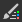

# 位图绘画工具

本页介绍[2D 视图](../../../interface/2d-view/2d-view.md)面板中可用于兼容位图的绘画工具。

{width="512px"}

## 概述

[2D 视图](../../../interface/2d-view/2d-view.md)面板提供了基本的位图绘画工具，您可以直接在应用程序中&#x200B;*手动*&#x200B;创建或编辑图像。 例如，这些工具对于快速绘制&#x200B;*蒙版*&#x200B;特别有用。

这些工具支持笔输入，包括&#x200B;*笔压力*。 要利用笔显示功能，您可以[取消停靠](../../../interface/customizing-your-wor/customizing-your-workspace.md) [2D 视图](../../../interface/2d-view/2d-view.md)面板，然后将其放置并调整到更适合绘画的任何配置中。

编辑操作可以&#x200B;*逐个撤消*，并且您仍然可以在编辑图像时&#x200B;*使用* 2D 视图面板的所有其他功能，例如[直方图](../../../interface/2d-view/2d-view.md)面板、[拼贴显示](../../../interface/2d-view/2d-view.md)和[背景图像](../../../interface/2d-view/2d-view.md)。

>[!IMPORTANT]
>
> 您只能&#x200B;*在* 8位&#x200B;*[位图资源](../../../resources/bitmap-resource/bitmap-resource.md)上绘画* 1&rbrace;，这些位图资源是[新的或导入的](../../../resources/importing-linking-and-new/importing-linking-and-new-resources.md)。

>[!WARNING]
>
> **仅限Windows**
> 
> 平板电脑用户应应用下页中所述的设置以获得最可靠的体验： [配置笔和平板电脑](https://docs.substance3d.com/display/SPDOC/Configuring+Pens+and+Tablets)

{width="512px"}

## 启用绘画工具

当满足以下有关位图的条件时，将在[2D 视图](../../../interface/2d-view/2d-view.md)面板中自动启用绘画工具：

* 位图是[新的或导入的](../../../resources/importing-linking-and-new/importing-linking-and-new-resources.md)资源
* 位图具有&#x200B;*8位*&#x200B;精度
* 位图显示在[2D 视图](../../../interface/2d-view/2d-view.md)面板中

可通过以下方式创建&#x200B;*新的*&#x200B;位图：

* 在[资源管理器](../../../interface/the-explorer-window/the-explorer-window.md)面板中，单击&#x200B;*SBS包*&#x200B;或包中的&#x200B;*文件夹*&#x200B;上的人民币以打开其上下文菜单，然后打开<b>新建</b>子菜单并选择<b>位图</b>选项
* 在[图形](../../../interface/the-graph-view/the-graph-view.md)中，创建一个[位图节点](../../../compositing-graphs/nodes-reference-for-com/atomic-nodes/bitmap/bitmap.md)，然后在上下文菜单中选择<b>从新资源……</b>选项

将会打开<b>新位图</b>窗口，允许您设置新位图资源的&#x200B;*名称*、*分辨率*&#x200B;和&#x200B;*背景颜色*。

>[!NOTE]
>
> *新的*&#x200B;位图资源&#x200B;*始终*&#x200B;具有&#x200B;*RGBA*&#x200B;颜色和&#x200B;*8位*&#x200B;精度。

>[!WARNING]
>
> 为获得绘画工具的最佳性能，我们建议使用分辨率为&#x200B;*二的次方*&#x200B;的位图 — 例如128、256、512、1024...

## 工具栏

绘画工具和选项排列在[2D视图](../../../interface/2d-view/2d-view.md)面板的&#x200B;*工具栏*&#x200B;中。 这些工具栏可以重新定位到面板的&#x200B;*任意一侧*，或者作为&#x200B;*浮动工具栏*，方法是单击并按住其&#x200B;*手柄* <b>LMB</b> — 显示为三连线 — 然后在所需位置释放<b>LMB</b>。

启用绘画工具后，将显示两个工具栏： [工具选择工具栏](#bitmappaintingtools-toolselectiontoolbar)和工具选项工具栏，如下所述。

## 工具选择工具栏

可在&#x200B;**工具选择工具栏**&#x200B;中找到绘画工具，默认情况下，该工具栏放置在[2D视图](../../../interface/2d-view/2d-view.md)面板的&#x200B;*左侧*&#x200B;上。 键盘快捷键可让您快速访问这些工具，并且标记在工具/函数名称后的括号之间：

 <b>颜色选择</b> <b>缩略图：</b>用于定义&#x200B;*主要*&#x200B;和&#x200B;*次要*&#x200B;颜色。 单击其中任一缩览图以显示<b>颜色编辑器</b>窗口并定义颜色。 工具将使用&#x200B;*主要*&#x200B;颜色。 可以随时&#x200B;*交换* (<b>X</b>)

 <b>画笔工具(B)：</b>使用工具选项工具栏中定义的选项，在按下笔提示或<b>LMB</b>按钮时在光标位置应用&#x200B;*原色*&#x200B;颜色

 <b>图章工具(T)：</b>允许您将图像的一部分盖印到另一部分上。 您可以通过按住<b>Alt</b>键并单击<b>LMB</b>来定义应盖印的&#x200B;*源*。 然后，使用“工具选项”工具栏中定义的选项按住笔尖或<b>LMB</b>按钮时，图像的此区域将印在光标位置处的&#x200B;*目标*&#x200B;区域上。 请注意，源将&#x200B;*跟踪*&#x200B;目标的移动，并且&#x200B;*源*&#x200B;区域的大小将&#x200B;*匹配*&#x200B;画笔&#x200B;*的大小*

 <b>启用对齐方式（图章工具选项）：</b>用于定义在新图章开始时，源是应&#x200B;*保持在原位*，还是应&#x200B;*相对于新图章位置重定位*

<b>橡皮擦(E)：</b>使用工具选项工具栏中定义的选项，在按下笔提示或<b>LMB</b>按钮时，用光标位置处的(0， 0， 0， 0)值替换图像的当前颜色。 确保已启用[透明度显示](../../../interface/2d-view/2d-view.md)，以跟踪此Alpha对<b>工具</b>通道的影响。

## 工具选项工具栏

可在“工具选项”工具栏中找到[工具选择工具栏](#bitmappaintingtools-toolselectiontoolbar)中可用工具的选项，默认情况下，该工具栏位于[2D视图](../../../interface/2d-view/2d-view.md)面板的&#x200B;*顶部*。

<table>
<tr style="border: 0;">
<td style="border: 0;" valign="top">

### 画笔选区

 <b>画笔选区</b>允许您从可用画笔&#x200B;*预设*&#x200B;中选择&#x200B;*预配置*&#x200B;画笔，设置其<b>大小</b>和<b>硬度</b> *（*&#x200B;请参阅画笔编辑器的<b>形状</b>部分），并显示画笔描边的*预览*。

可以在画笔编辑器中创建和编辑笔刷预设，并在&#x200B;*库*&#x200B;中排列。 将显示在此面板中的画笔预设是所有加载的画笔预设库中的&#x200B;*和*。 可通过访问 <b>画笔库</b>菜单来管理这些库（请参阅画笔编辑器的<b>预设</b>部分）

使用 <b>选择背景颜色</b>按钮可更改&#x200B;*画笔描边预览*&#x200B;的背景颜色。

</td>
<td style="border: 0;" valign="top">

</td>
</tr>
</table>

<table>
<tr style="border: 0;">
<td style="border: 0;" valign="top">

### 画笔编辑器

 <b>画笔编辑器</b>提供粒度选项以定义画笔的行为：

<b>预设</b>

可自定义画笔，然后将其存储为<b>画笔预设</b>，之后将在 <b>画笔预设列表</b>和 <b>画笔选区</b>面板中提供。

要创建预设，请根据您的喜好设置下面的属性，然后单击 <b>添加画笔预设</b>按钮，并在<b>预设名称</b>窗口中设置画笔名称。 现在，新预设会自动在<b>画笔预设列表</b>中选择，您可以随时使用新的当前设置<b>更新</b>它，或<b>删除</b>它。

预设已整理并保存在&#x200B;*库*&#x200B;中，可以在 <b>画笔库</b>菜单中管理该库：

<b>导出库：</b> *将*&#x200B;当前预设及其所有设置保存到库文件中

<b>导入库：</b> *从现有库文件中加载*&#x200B;个预设，然后将其&#x200B;*添加*&#x200B;到当前列表 — 具有&#x200B;*相同名称的预设将被库文件中的预设替换*

<b>重置库：</b>使用默认库重置当前预设

<b>替换库：</b> 从现有库文件&#x200B;*加载*&#x200B;预设，并&#x200B;*关闭*&#x200B;当前列表

</td>
<td style="border: 0;" valign="top">

</td>
</tr>
</table>

#### 笔刷设置

画笔的设置分为以下几部分：

+++形状
<b>形状类型</b>参数控制画笔的基本形状。 可用的形状包括：

* *椭圆*：默认情况下，圆形设置为&#x200B;*圆*

* *矩形*：默认情况下，直形状设置为&#x200B;*正方形*

* *多边形*：具有&#x200B;*可自定义*&#x200B;个边缘和角度的直形状

<b>边缘计数</b>（仅限&#x200B;*多边形*&#x200B;形状）：允许您选择多边形的&#x200B;*个面*&#x200B;的数目

<b>内径</b>（*多边形*&#x200B;形状）：提供对面&#x200B;*中点*&#x200B;和形状中心之间距离的控制，从而有效地创建了&#x200B;*星形*&#x200B;图案

<b>硬度</b>：定义形状的&#x200B;*渐隐半径*

+++

+++变换
将画笔描边应用于图像时，描边实际上是画笔图案的重复盖印，遵循本节中控件所定义的行为。

<b>大小</b>：设置画笔形状的&#x200B;*直径*（以像素为单位）

<b>大小抖动</b>：允许您&#x200B;*随机化*&#x200B;每个图章的画笔大小，表示为<b>大小</b>值的&#x200B;*百分比*，并控制从<b>0</b>到<b>大小</b>值的&#x200B;*范围*&#x200B;随机值

<b>大小控制</b>：如果使用支持&#x200B;*笔压力*&#x200B;的笔输入，则可以使用此参数使其控制画笔大小

<b>间距</b>：控制画笔描边上每个单独的图章之间&#x200B;*的间距*。 这有助于更清晰地分隔和定义形状图案

<b>圆度</b>：默认情况下，在<b>形状</b>部分中选择的<b>形状类型</b>的宽度/Height比为&#x200B;*1:1*。 此参数允许您通过&#x200B;*降低宽度*（作为Height的百分比）来更改此比率

<b>圆度抖动</b>：允许您&#x200B;*随机化*&#x200B;每个图章的粗糙度，以<b>圆度</b>值的&#x200B;*百分比*&#x200B;表示，并控制从<b>0</b>到<b>粗糙度</b>值的&#x200B;*范围*&#x200B;随机值

<b>角度</b>：以&#x200B;*度*&#x200B;为单位控制画笔图案的&#x200B;*旋转*

<b>角度抖动</b>：允许您&#x200B;*随机化*&#x200B;每个图章的旋转，以<b>角度</b>值的&#x200B;*百分比*&#x200B;表示，并控制随机值的&#x200B;*范围*，范围从<b>0</b>到<b>360 </b>度

+++

+++散射
默认情况下，形状图案会严格沿着描边盖章。 您可能需要通过对形状图案应用偏移来中断此操作，以便可以将它们散布在描边周围以获得更有机的或混乱的效果。

<b>散点</b>：每个图章相对于描边的最大偏移量&#x200B;*距离*，以&#x200B;*画笔大小*&#x200B;的百分比表示。 请注意，此距离是从<b>0</b>到画笔大小的&#x200B;*设置百分比*&#x200B;的&#x200B;*默认随机分布*，并且偏移的&#x200B;*方向*&#x200B;也是随机分布

<b>计数</b>：单个图章的散布副本数

+++

+++颜色
画笔应用的颜色由&#x200B;*所选主色*&#x200B;和<b>画笔纹理</b>（如果当前应用了纹理）定义。 此颜色可使用本节中的控件动态更改。

<b>流抖动</b>：允许您&#x200B;*随机化*&#x200B;每个图章的流，以最大流的&#x200B;*百分比*&#x200B;表示

<b>流量控制</b>：如果使用支持&#x200B;*笔压力*&#x200B;的笔输入，则可以使用此参数使其控制流量

<b>色相抖动</b>：允许您&#x200B;*随机化*&#x200B;每个图章的色相&#x200B;*偏移*，用整个色相范围的&#x200B;*百分比*&#x200B;表示

<b>饱和度抖动</b>：允许您&#x200B;*随机化*&#x200B;每个图章的颜色饱和度&#x200B;*偏移*，以整个饱和度范围的&#x200B;*百分比*&#x200B;表示

<b>亮度抖动</b>：允许您&#x200B;*随机化*&#x200B;每个图章的颜色亮度&#x200B;*偏移*，以整个亮度范围的&#x200B;*百分比*&#x200B;表示

+++

+++纹理
您可以将&#x200B;*位图文件*&#x200B;应用于画笔，并将其用于图章&#x200B;*该位图*，而不是纯色。 画笔纹理的行为如下：

<b>纹理文件： </b>定义应用作画笔纹理的位图的&#x200B;*路径*。 您可以使用输入字段旁边的按钮，通过系统文件浏览器选择位图

纹理&#x200B;*仅*&#x200B;替换了画笔的基本平面颜色，这意味着&#x200B;*上面列出的所有画笔属性仍可以使用*，并且按所述运行

纹理的颜色向&#x200B;*设置主色*&#x200B;偏移&#x200B;*色相*，这意味着如果设置的主色为白色，则纹理颜色可以按原样使用。 设置的主色越饱和，纹理颜色的色相向它偏移的程度就越高

+++

### 不透明度/流量

画笔、图章和橡皮擦工具提供<b>不透明度</b>和<b>流量</b>的控件：

<b>不透明度</b>控制图章的&#x200B;*最大不透明度*。 它是&#x200B;*对单独笔触的附加*，这意味着通过在该区域执行多个&#x200B;*单独的*&#x200B;笔触，可以将该区域的不透明度添加回其最大值100%

<b>流量</b>控制在任何给定时间应用的&#x200B;*工具效果量*。 它是&#x200B;*对同一描边*&#x200B;的附加值，这意味着通过对该区域执行&#x200B;*同一描边*&#x200B;的多次处理或多个单独的描边，可以将该区域的不透明度添加回其最大值100%。

<table>
<tr style="border: 0;">
<td width="100.00%" style="border: 0;" valign="top">

### 拼贴模式

画笔、图章和橡皮擦工具还允许您设置其 <b>拼贴模式</b>，这定义了当描边影响图像边界之外的区域时，这些工具能够&#x200B;*环绕*&#x200B;到图像另一侧的能力：

<b>平铺X和Y</b>：画笔描边平铺&#x200B;*水平和垂直*

<b>拼贴X</b>：画笔描边拼贴&#x200B;*仅限水平方向*

<b>拼贴Y</b>：画笔描边拼贴&#x200B;*仅垂直*

<b>无拼贴</b>：画笔描边&#x200B;*不拼贴*

</td>
<td width="25.00%" style="border: 0;" valign="top">

</td>
</tr>
</table>
