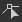

# 矢量编辑工具

本页介绍了兼容矢量图形的[2D 视图](https://docs.substance3d.com/display/SDDOC/2D+view)面板中可用的编辑工具。

## 概述

<table>
<tr style="border: 0;">
<td style="border: 0;" valign="top">

[2D 视图](https://docs.substance3d.com/display/SDDOC/2D+view)面板提供了基本的矢量编辑工具，可让您直接在[Substance 3D Designer](https://www.adobe.com/cn/products/substance3d-designer.html)中&#x200B;*手动*&#x200B;创建或编辑矢量图形。 例如，这些工具对于快速创建&#x200B;*蒙版*&#x200B;或&#x200B;*图案*&#x200B;尤为有用。

这些工具支持笔输入。 要利用笔显示功能，您可以[取消停靠](https://docs.substance3d.com/display/SDDOC/Customizing+your+workspace)[2D 视图](https://docs.substance3d.com/display/SDDOC/2D+view)面板，然后将其放置并调整到更适合绘画的任何配置中。

编辑操作可以&#x200B;*逐个撤消*，并且在编辑矢量图像时，“2D 视图”面板的所有其他功能仍然&#x200B;*可用*，例如[直方图](https://docs.substance3d.com/display/SDDOC/2D+view#id-2Dview-Histogram)面板、[拼贴显示](https://docs.substance3d.com/display/SDDOC/2D+view#id-2Dview-Viewport)和[背景图像](https://docs.substance3d.com/display/SDDOC/2D+view#id-2Dview-Backgroundimage)。

</td>
<td style="border: 0;" valign="top">

{width="512px"}

</td>
</tr>
</table>

>[!TIP]
>
> **仅限Windows**
> 
> Tablet用户应应用下页中所述的设置，以便在Designer中获得最可靠的体验： [配置笔和平板电脑](https://docs.substance3d.com/display/SPDOC/Configuring+Pens+and+Tablets)

>[!IMPORTANT]
>
> 您只能&#x200B;*在* 8位&#x200B;*[矢量图形资源](../../../resources/vector-graphics-svg-res/vector-graphics-svg-resource.md)上绘画* 1}，这些资源是[新的或导入的](https://docs.substance3d.com/display/SDDOC/Importing%2C+Linking+and+New+Resources)。

{width="512px"}

## 启用矢量编辑工具

当满足以下有关矢量图形图像的条件时，将在[2D 视图](https://docs.substance3d.com/display/SDDOC/2D+view)面板中自动启用矢量编辑工具：

* 矢量图形图像是[新资源或导入的](https://docs.substance3d.com/display/SDDOC/Importing%2C+Linking+and+New+Resources)资源
* 位图显示在[2D 视图](https://docs.substance3d.com/display/SDDOC/2D+view)面板中

可通过以下方式创建&#x200B;*新的*&#x200B;矢量图形图像：

* 在[资源管理器](https://docs.substance3d.com/display/SDDOC/The+Explorer+Window)面板中，单击&#x200B;*SBS包*&#x200B;或包中的&#x200B;*文件夹*&#x200B;上的人民币以打开其上下文菜单，然后打开&#x200B;**新建**&#x200B;子菜单并选择&#x200B;**SVG**&#x200B;选项
* 在[图形](https://docs.substance3d.com/display/SDDOC/The+Graph+view)中，创建一个[SVG节点](../../../compositing-graphs/nodes-reference-for-com/atomic-nodes/svg/svg.md)，然后在上下文菜单中选择&#x200B;**从新资源……**&#x200B;选项

将会打开&#x200B;**新建矢量数据**&#x200B;窗口，允许您设置新矢量图形资源的&#x200B;*名称*&#x200B;和&#x200B;*分辨率*。

>[!TIP]
>
> 要获得矢量编辑工具的最佳性能，我们建议使用分辨率为&#x200B;*二的次方*&#x200B;的矢量图形图像，例如128、256、512、1024...

### 从其他软件导出矢量图形

Designer *仅*&#x200B;支持使用&#x200B;**SVG**&#x200B;文件格式的矢量图形。

为实现Designer及其编辑工具中的最佳兼容性和可靠性，请确保将所有对象转换为&#x200B;*轮廓*，并使用&#x200B;*纯色*&#x200B;取消组合为&#x200B;*单独的*&#x200B;对象，以便&#x200B;*不会保留以下任何内容*：

* **文本**
* **渐变**
* **图案**（适用于填充和描边轮廓）
* **样式**

**Adobe Illustrator**&#x200B;用户可参考附加的图像以了解推荐的SVG *导出设置。*

+++Adobe Illustrator导出选项

+++

>[!NOTE]
>
> 要了解有关SVG限制、从Designer中的其他软件和SVG属性导出的更多信息，请参阅[矢量图形(SVG)资源](../../../resources/vector-graphics-svg-res/vector-graphics-svg-resource.md)部分。

## 工具

绘画工具和选项排列在[2D视图](https://docs.substance3d.com/display/SDDOC/2D+view)面板的&#x200B;*工具栏*&#x200B;中。 这些工具栏可以重新定位到面板的&#x200B;*任意一侧*，或者作为&#x200B;*浮动工具栏*，方法是单击并按住其&#x200B;*手柄* **LMB** — 显示为三连线 — 然后在所需位置释放&#x200B;**LMB**。

启用矢量编辑工具后，将显示两个工具栏：

* **工具选择** **工具栏**：允许您&#x200B;*选择工具*&#x200B;以及&#x200B;*填充/轮廓颜色*，并且默认情况下位于2D视图面板的&#x200B;*左侧*&#x200B;上
* **工具选项工具栏**：允许您设置&#x200B;*当前所选工具*&#x200B;的&#x200B;*选项*，默认情况下将置于2D视图面板的&#x200B;*顶部*&#x200B;侧

键盘快捷键可让您快速访问工具，并且标记在工具/函数名称后的括号之间：

+++颜色选区
使用 **颜色选择** *缩览图*，您可以为矢量形状定义&#x200B;*填充*&#x200B;和&#x200B;*轮廓*&#x200B;颜色。 您可以通过以下方式为其中每种颜色打开&#x200B;**颜色编辑器**：

* **填充颜色：**&#x200B;单击&#x200B;*填充*&#x200B;颜色缩览图（顶部），或双击画布上的LMB

* **轮廓颜色：**&#x200B;单击&#x200B;*轮廓*&#x200B;颜色缩略图（底部），或&#x200B;*按住Ctrl*&#x200B;并双击画布上的LMB

然后，这些设置的颜色将应用于&#x200B;*当前选定的形状*。

如果当前&#x200B;*轮廓*&#x200B;颜色为&#x200B;*黑色* — 即明亮度0或RGB(0， 0， 0) — 则&#x200B;*不*&#x200B;将应用于选定的形状，直到您&#x200B;*单击轮廓颜色缩览图*。

+++

+++变换
{width="512px"}

 <b>变换</b>工具(<b>V</b>)可以选择形状，然后将这些形状包括在变换小工具中。 此小工具允许您执行以下操作：

<b>移动</b>：单击并按住LMB *内部*&#x200B;小工具

<b>缩放</b>：单击并按住&#x200B;*方形手柄*&#x200B;上任何LMB沿线框沿&#x200B;*水平、垂直或同时垂直缩放*&#x200B;对象。 默认情况下，缩放相对于Gizmo *相对*&#x200B;侧的手柄完成。 您可以按住<b>Alt</b>键以相对于线框&#x200B;*中心*&#x200B;执行缩放，并按住<b>Shift</b>键以&#x200B;*锁定*&#x200B;线框宽度/Height *比例*

<b>旋转： </b>单击并按住线框&#x200B;*外部*&#x200B;中任意&#x200B;*方形手柄*&#x200B;旁边的LMB。

+++

+++节点
{width="512px"}

使用 <b>节点</b>工具(<b>A</b>)，您可以选择所选形状的单个顶点（即节点），编辑其位置和手柄，以及添加和删除顶点。 选择形状后，可以执行以下操作：

<b>在形状轮廓上添加顶点：</b> Ctrl+LMB

<b>删除顶点</b>：在顶点上按Ctrl+LMB

<b>移动顶点</b>：在顶点上按住LMB

<b>移动顶点手柄</b>：在手柄上按住LMB

<b>独立移动顶点手柄</b>：按住Alt+LMB的同时移动手柄。 请注意，超过此点后，手柄将&#x200B;*未链接*，直到它们&#x200B;*重置*

<b>重置手柄</b>：在顶点上单击Alt+LMB。 手柄将重置为&#x200B;*顶点位置*

<b>移动重置顶点手柄</b>：在顶点上按住Alt+LMB。 将显示&#x200B;*链接的*&#x200B;手柄

+++

+++形状
{width="512px"}

 <b>形状</b>工具(<b>M</b>)使用当前的&#x200B;*填充*&#x200B;颜色提供了一组原始形状，可以从生成和编辑这些形状：

* <b>矩形；</b>

* <b>椭圆；</b>

* <b>圆角矩形：</b>圆角具有锁定的半径；

* <b>多边形：</b>创建八边形。

若要绘制基元，请从画布的任何&#x200B;*角*&#x200B;按住<b>LMB</b>到任意位置。 按住<b>Alt+LMB</b>以从形状的&#x200B;*中心*&#x200B;绘制形状。

+++

+++画笔
{width="512px"}

 <b>钢笔</b>工具(<b>P</b>)允许您使用当前的&#x200B;*填充*&#x200B;颜色绘制新的自定形状。 有两种模式可用：

在<b>路径</b>模式下，形状绘制为&#x200B;*一次一个顶点*。 可以使用以下控件：

添加<b>直接入点/直接出点</b>顶点：单击LMB

添加<b>曲线向内/向外延伸</b>顶点（*对齐*&#x200B;切线）：按住LMB键并拖动

添加<b>曲线输入/输出</b>顶点（*未对齐*&#x200B;切线）\*：按住LMB并拖动，然后按住Alt+LMB

添加<b>曲线入/直出</b>顶点\*：与曲线入/曲线出顶点（未对齐的切线）相同，但出线需要置于*&#x200B;新顶点的上方*

添加<b>直进/直出</b>顶点\*：按住Alt+LMB并拖动

*下一个*&#x200B;顶点上的<b>关闭形状</b>：按住Ctrl

在&#x200B;*当前*&#x200B;顶点上<b>关闭形状</b>：按Enter键或单击当前形状的&#x200B;*第一个顶点*&#x200B;上的LMB

<b>徒手</b>模式允许您通过按住LMB的同时在画布上拖动笔来直接绘制形状。

顶点&#x200B;*自动沿描边放置*，以便生成的路径尽可能与描边匹配。 当描边结束时，形状是&#x200B;*自动闭合的*，将描边中的第一个顶点连接到最后一个路径。

+++

+++凸出
{width="512px"}

 **凸出**&#x200B;工具(E) *将使用*&#x200B;绘制模式&#x200B;*沿路径绘制的*&#x200B;设置直径&#x200B;*的形状*&#x200B;相加，并按照选项工具栏中设置的&#x200B;*合并模式*&#x200B;在画布中应用结果。

以下&#x200B;*绘图模式*&#x200B;可用：

 **自由形状**：通过按住LMB的同时在画布上拖动&#x200B;*笔来直接绘制形状*。 当描边结束时，形状会添加在一起。

 **多边形**：通过单击LMB添加角度，一次绘制一个脸部&#x200B;*的形状*。 按Enter键时，形状会添加在一起。

可使用以下参数控制绘制的形状：

<b>大小</b>：控制在光标位置绘制的径向形状的直径。

<b>Smoothness</b>：控制在描边末尾将绘制的形状相加在一起时，绘制的形状应&#x200B;*平滑和简化*&#x200B;的数量。

绘制完成后，形状会添加在一起，并使用以下可用的&#x200B;*合并模式*&#x200B;与当前选定的形状合并：

 **不合并**：此形状在所选形状的&#x200B;*顶部*&#x200B;绘制为&#x200B;*单独对象*。

 **联合**：该形状已&#x200B;*添加*&#x200B;到所选形状。

 **相减**：该形状为所选形状的&#x200B;*截断*。

 **交集**：仅新形状和所选形状的&#x200B;*重叠*&#x200B;部分保留。

+++

## 形状操作

{width="512px"}

除了上面列出的工具之外，还可以使用单击“人民币”时可用的上下文菜单对&#x200B;*选定的形状*&#x200B;执行一些操作。 这些操作几乎都有键盘快捷键（位于下方的括号中），按以下类别排列：

+++添加和删除形状
<b>复制选区</b> (Ctrl+C)： *复制*&#x200B;所选形状到剪贴板

<b>剪切选区</b> (Ctrl+X)： *将*&#x200B;所选形状复制到剪贴板，然后&#x200B;*移除*&#x200B;形状

<b>粘贴</b> (Ctrl+V)：在&#x200B;*光标位置*&#x200B;创建当前剪贴板中的复制形状

<b>原位粘贴</b> (Ctrl+Shift+V)：在&#x200B;*复制的形状位置*&#x200B;创建当前剪贴板中的复制的形状

<b>删除选区</b> (Del)： *删除*&#x200B;所选形状

+++

+++排列形状
形状在&#x200B;*栈叠*&#x200B;中排列，这设置画布中形状的&#x200B;*顺序*，即位于画布之上。 默认情况下，新形状在画布的&#x200B;*顶部*&#x200B;创建，您可以通过以下控件更改这种排列方式：

<b>置于顶层</b>（主页）： *将*&#x200B;所选形状提升到形状栈栈的&#x200B;*顶部*

<b>上移一层</b> (PgUp)： *上移一层*&#x200B;将所选形状在形状栈栈中上移一层&#x200B;**

<b>向后发送</b> (PgDown)： *降低*&#x200B;将所选形状在形状栈栈中下移&#x200B;*一级*

<b>置于最后</b>（结束）： *将*&#x200B;所选形状降低&#x200B;*底部*&#x200B;形状栈叠

+++

+++发送到新SVG图像
您可以在当前[SBS包](../../../getting-started/overview/overview.md)中使用当前图像中的形状创建&#x200B;*新的[SVG资源](../../../resources/vector-graphics-svg-res/vector-graphics-svg-resource.md)*。 在这方面，可以采取下列行动：

<b>将选区复制到新SVG</b>：创建新的SVG资源，并将所选形状&#x200B;*原地复制*&#x200B;到此新图像中。

<b>将选区剪切到新SVG</b>：创建新的SVG资源，在此新图像中&#x200B;*原地复制*&#x200B;所选形状，然后&#x200B;*从*&#x200B;当前图像&#x200B;*中*&#x200B;移除这些形状。

+++
