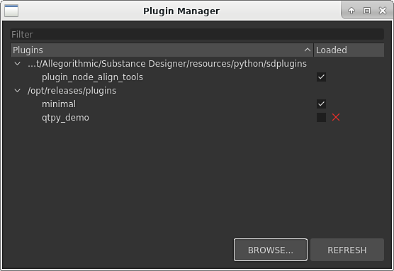

# 插件管理器

可以从主菜单栏中的<b>工具</b>菜单访问<b>插件管理器</b>对话框。 通过它，您可以看到哪些增效工具处于&#x200B;*活动*&#x200B;状态，以及&#x200B;*加载和卸载*&#x200B;增效工具。

也可以通过使用<b>浏览</b>按钮并选择Python文件来&#x200B;*手动*&#x200B;加载插件。

<b>刷新</b>按钮可用于&#x200B;*更新*&#x200B;插件列表。 在使用Python API加载插件时，此功能非常有用。

>[!NOTE]
>
> 如果增效工具是&#x200B;*模块*（即目录），则可以通过选择模块内的<b>\_\_init\_\_.py</b>文件来加载它。
