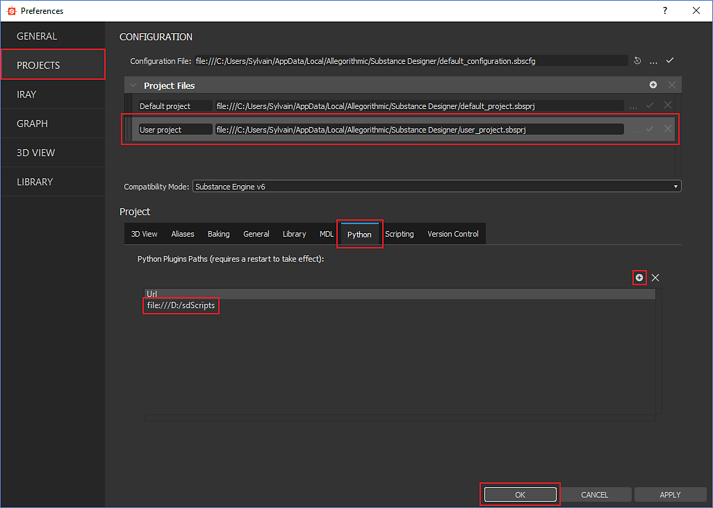

# 增效工具搜索路径

Designer将在特定目录（即，搜索路径）中查找插件。 本页介绍如何配置这些路径。

用户可以在软件首选项中手动&#x200B;*添加自定义目录*，或使用环境变量指定它们。

## 手动添加插件搜索路径

1. 转到<b>编辑>首选项……</b>
1. 选择<b>项目</b>类别
1. 选择要编辑的<b>项目文件</b>
1. 在<b>Python</b>选项卡中，单击*<b>+</b>*按钮以添加包含插件的目录
1. 单击“<b>确定</b>”进行验证

## 使用环境变量

应用程序将在使用<b>SBS\_DESIGNER\_PYTHON\_PATH </b>环境变量指定的所有路径中查找插件。
