# 提取材料值和纹理

可以提取材料的属性以用于Substance图形。

## 从纹理新建图形

“从纹理输入创建图形”操作可创建一个新的Substance图形，其中包含材料使用的所有纹理

使用此操作时发生一些问题：

* 将在所选位置创建一个以材料命名的Substance图形。
* 为材料使用的每个纹理创建[位图资源](../../resources/bitmap-resource/bitmap-resource.md)，该位图资源放置在“资源”文件夹下以材料命名的文件夹中。
* 在该图形中，为每个位图资源创建[位图](../../compositing-graphs/nodes-reference-for-com/atomic-nodes/bitmap/bitmap.md)节点，并使用纹理自动连接到在材料属性之后配置的[输出](../../compositing-graphs/nodes-reference-for-com/atomic-nodes/output/output.md)节点。
* 如果使用同一纹理的每个通道来驱动不同的材料属性（该技术称为[通道打包](../../glossary/glossary.md)），则会自动添加[灰度转换](../../compositing-graphs/nodes-reference-for-com/atomic-nodes/grayscale-conversion/grayscale-conversion.md)节点以选择适当的通道。
* 图形会自动连接到该材料，并且只有在图形中进行编辑后，其外观才能更改。

<table>
<tr style="border: 0;">
<td style="border: 0;" valign="top">

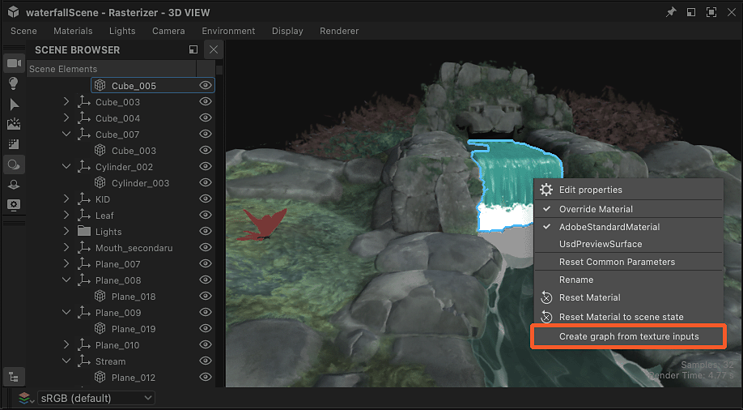{zoomable="yes"}

*视口中的操作*

</td>
<td style="border: 0;" valign="top">

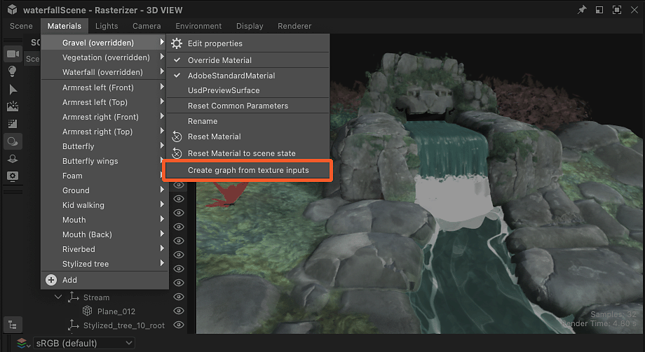{zoomable="yes"}

*材料菜单中的操作*

</td>
<td style="border: 0;" valign="top">

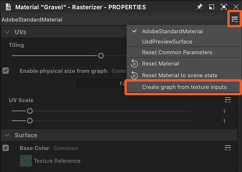{zoomable="yes"}

*属性停放中的操作*

</td>
</tr>
</table>

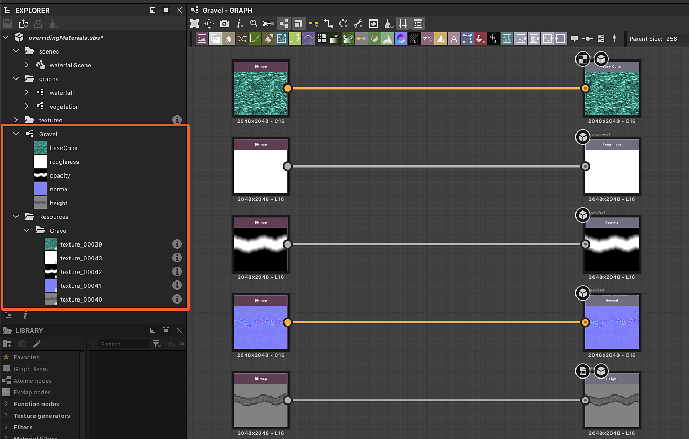{zoomable="yes"}

*从纹理创建图形的结果*

+++演示
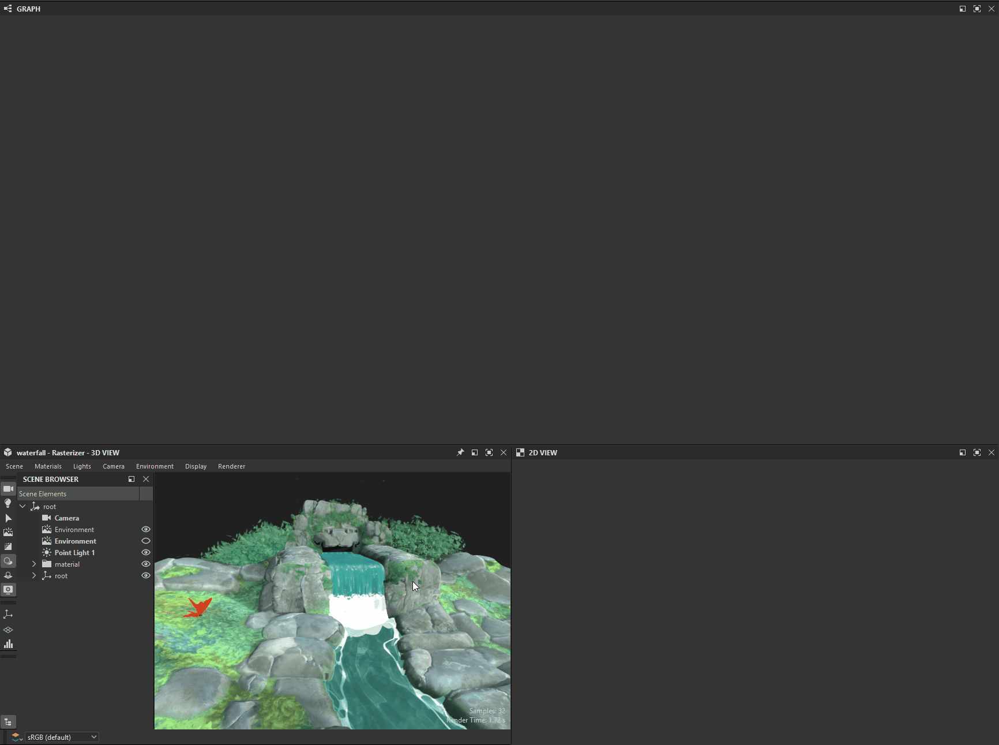{zoomable="yes"}

+++

>[!TIP]
>
> 您可以将光标放在对象上并按<b>Shift+LMB</b>以选择对象，从而在视口中快速而直接地访问该动作。 然后点击“RMB”（人民币）访问该动作的上下文菜单。

>[!NOTE]
>
> 对于使用&#x200B;*嵌入纹理*&#x200B;的格式（例如：USDZ），需要在磁盘上提取和复制纹理。 这会导致执行额外的步骤，以选择提取纹理的位置。

## 提取纹理

“将纹理提取到图形”操作可在现有图形中为素材所使用的纹理创建新的位图节点。

使用此操作时发生一些问题：

* 为素材使用的纹理创建[位图资源](../../resources/bitmap-resource/bitmap-resource.md)，并将其放置在“Resources”文件夹下以素材命名的文件夹中。
* 在选定的图形中，将为该位图资源创建[位图](../../compositing-graphs/nodes-reference-for-com/atomic-nodes/bitmap/bitmap.md)节点，并自动连接到使用该纹理在材质属性之后配置的[输出](../../compositing-graphs/nodes-reference-for-com/atomic-nodes/output/output.md)节点。

如果图形中已存在为素材属性&#x200B;*配置的输出*，则&#x200B;*不会创建任何节点*，只会执行位图资源创建。

例如：将“基色”属性的纹理提取到已承载为“基色”配置的输出节点的图表将导致未在图形中创建节点。

<table>
<tr style="border: 0;">
<td style="border: 0;" valign="top">

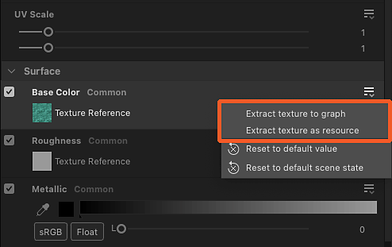{zoomable="yes"}

在“属性”停放中对材质属性执行的操作

</td>
<td style="border: 0;" valign="top">

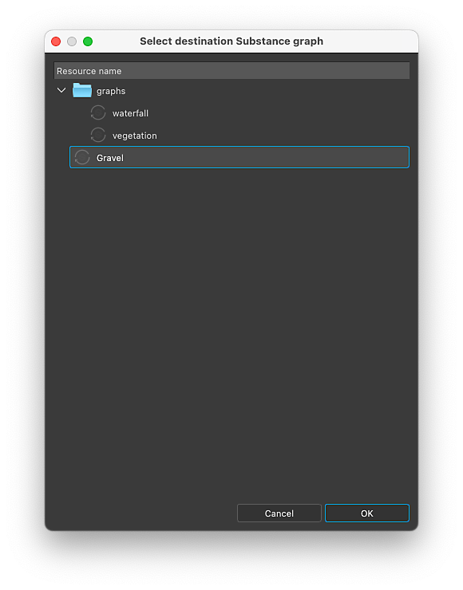{zoomable="yes"}

“选择目标图表”对话框

</td>
<td style="border: 0;" valign="top">

</td>
</tr>
</table>

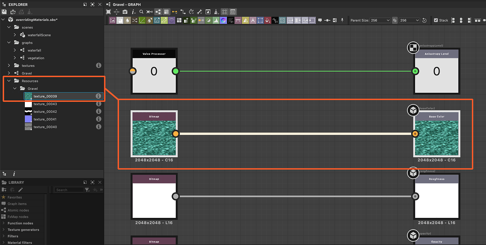{zoomable="yes"}

纹理提取的结果

+++演示
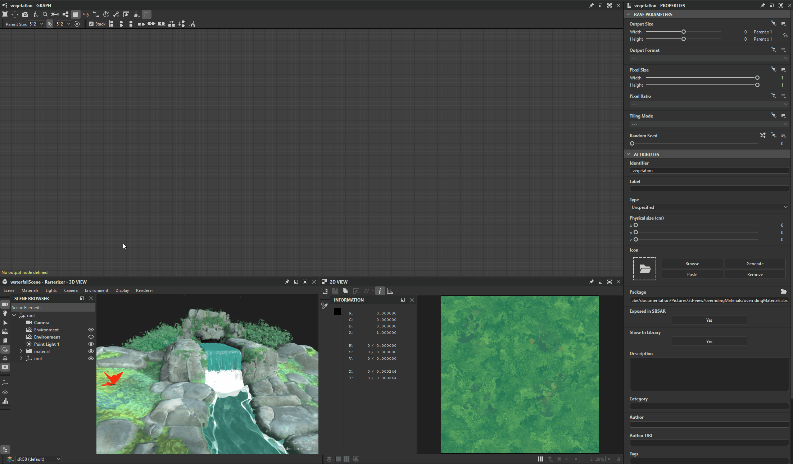{zoomable="yes"}

+++

“将纹理提取为资源”操作只会为素材所使用的纹理创建位图资源，并将它放在“资源”文件夹下以素材命名的文件夹中。

>[!NOTE]
>
> 对于使用&#x200B;*嵌入的纹理*&#x200B;的格式（例如：USDZ），需要在磁盘上提取和复制纹理。 这会导致额外的步骤，即选择提取纹理的位置。

## 提取值

“将值提取到图形”操作可为素材属性值在现有图形中创建新的[值处理器](../../compositing-graphs/nodes-reference-for-com/atomic-nodes/value-processor/value-processor.md)节点。

使用此操作时发生一些问题：

* 在选定的图形中，为该属性值创建了一个[值处理器](../../compositing-graphs/nodes-reference-for-com/atomic-nodes/value-processor/value-processor.md)节点，并自动连接到在该素材属性之后配置的[输出](../../compositing-graphs/nodes-reference-for-com/atomic-nodes/output/output.md)节点。
* 在值处理器节点的[Substance函数图形](../../function-graphs/function-graphs.md)中，创建与值类型匹配的[常量节点](../../function-graphs/nodes-reference-for-fun/atomic-function-nodes/constant-nodes/constant-nodes.md)，并将其设置为设置为设置为图形输出的提取值。

如果图形中已存在为素材属性&#x200B;*配置的输出*，则&#x200B;*不会创建任何节点*。

例如：将“各向异性级别”属性的值提取到已承载为“各向异性级别”配置的输出节点的图形将导致未在图形中创建节点。

<table>
<tr style="border: 0;">
<td style="border: 0;" valign="top">

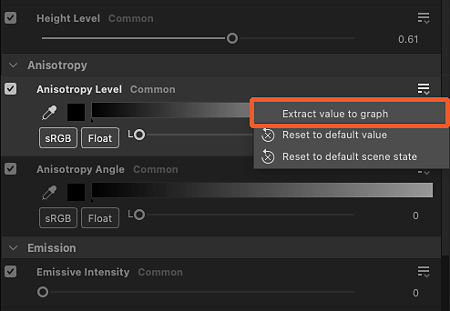{zoomable="yes"}

在“属性”停放中对材质属性执行的操作

</td>
<td style="border: 0;" valign="top">

{zoomable="yes"}

“选择目标图表”对话框

</td>
<td style="border: 0;" valign="top">

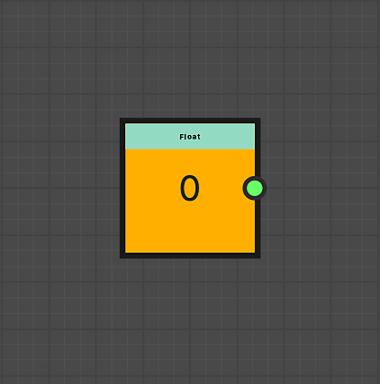{zoomable="yes"}

值处理器节点函数中的常量节点

</td>
</tr>
</table>

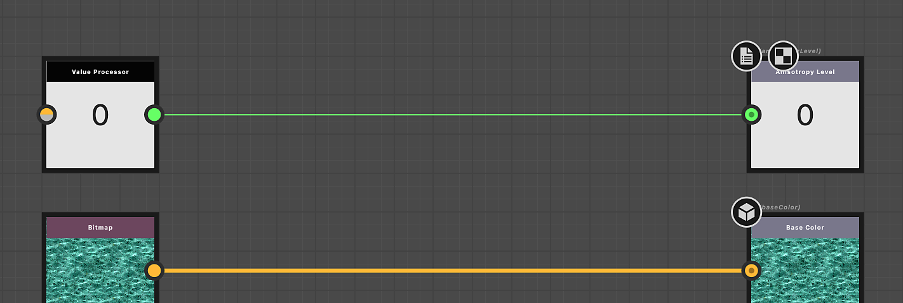{zoomable="yes"}

值提取的结果

+++演示
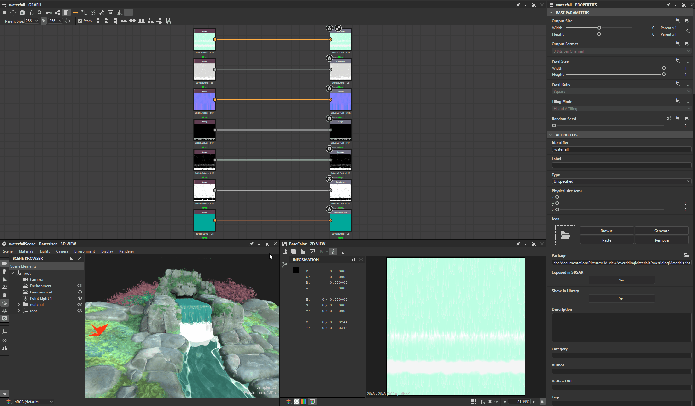{zoomable="yes"}

+++
