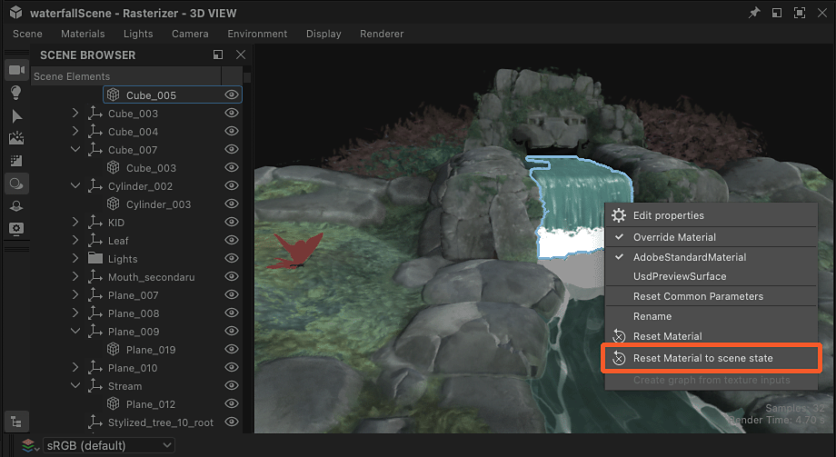

# 覆盖场景材质

在使用现有素材处理3D场景时，需要覆盖这些素材才能将其替换为您自己的素材。

您的素材可以从头开始构建，也可以使用已[提取到Substance图形](../../working-with-3d-scenes/extracting-materials-val/extracting-materials-values-and-textures.md)中的场景素材的调整版本。

{zoomable="yes"}

<table>
<tr style="border: 0;">
<td style="border: 0;" valign="top">

## 覆盖场景材质

</td>
<td style="border: 0;" valign="top">

### 重置为场景状态

</td>
<td style="border: 0;" valign="top">

### 连接的材质

</td>
</tr>
</table>

## 覆盖场景材质

场景中使用的所有素材都可由您自己的版本覆盖，即新素材或现有素材的编辑版本。

“覆盖材质”操作可在两个位置找到：

* 打开“材质”菜单并转到所需材质的子菜单
* 按住场景对象上的Shift + LMB键将其选中，然后单击RMB键以打开上下文菜单

<table>
<tr style="border: 0;">
<td style="border: 0;" valign="top">

{zoomable="yes"}

*3D视图视口中的操作*

</td>
<td style="border: 0;" valign="top">

{zoomable="yes"}

*“材质”菜单中的操作*

</td>
</tr>
</table>

在Designer（使用USD作为其内部场景描述）的上下文中，覆盖意味着&#x200B;*创建尽可能与原始图像匹配的素材副本*，并将场景网格的&#x200B;*素材装订*&#x200B;从原始图像更改为副本。

>[!NOTE]
>
> 副本在根下的“<b>material</b>”文件夹（以USD表示，为“Scope”）中创建，并使用与原始副本相同的标识符加上数字后缀（例如：“rustedMetal\_0”）

这意味着两件重要的事情：

1. 原始素材绝不会有任何改变。
1. 在Designer中完成的任何工作都将应用于该副本。

如果您想恢复原始场景的素材或在需要时执行快速前后检查，则可以通过同一“覆盖素材”操作随时打开和关闭任何覆盖

考虑到副本是为匹配原始内容而创建的，在大多数情况下，覆盖材质不应更改其外观（请参阅下面的注释），直到将Substance图形连接到它或编辑其属性为止。

>[!NOTE]
>
> 应用覆盖时，Designer会计算受影响网格的切线和二项式，这可能需要一些时间并更改这些网格的方面，特别是在这些网格没有定义正常比例和偏差或使用其他比例和偏差时。

>[!IMPORTANT]
>
> <b>AdobeStandardMaterial</b>着色模型在Substance 3D生态系统中受支持，但不是行业标准，因此&#x200B;*可能不受第三方应用程序（如Blender）支持*。
> 
> 为实现Substance 3D应用程序外部的最佳互操作性，目前建议使用<b>UsdPreviewSurface</b>着色模型，即使该模型支持的材料属性和效果少得多。

## 重置为场景状态

如果需要恢复到材料的初始状态，同时保持其覆盖状态并且仍可对其进行编辑，则可以将任何材料副本重置为初始值。

如果修改了材料属性值，或对图形应用了纹理，该属性将恢复为初始值或纹理。

材料可以完全重置，也可以按属性重置。

使用材料子菜单或网格上下文菜单中的“将材料重置为场景状态”操作可完全重置材料。

该操作可在三个位置找到：

* 打开“材质”菜单并转到所需材质的子菜单
* 按住场景对象上的Shift + LMB键将其选中，然后单击RMB键以打开上下文菜单
* 那个材料房顶上的汉堡菜单

<table>
<tr style="border: 0;">
<td style="border: 0;" valign="top">

{zoomable="yes"}

*3D视图视口中的操作*

</td>
<td style="border: 0;" valign="top">

{zoomable="yes"}

*“材质”菜单中的操作*

</td>
<td style="border: 0;" valign="top">

{zoomable="yes"}

*材料属性中的操作*

</td>
</tr>
</table>

<table>
<tr style="border: 0;">
<td style="border: 0;" valign="top">

如果只想重置材料的某些方面，也可以在材料属性中&#x200B;*每个属性*&#x200B;使用该操作。

打开材料属性的汉堡菜单以查找“重置为默认场景状态”操作。

</td>
<td style="border: 0;" valign="top">

{zoomable="yes"}

</td>
</tr>
</table>

## 连接的材质

同样：Designer不会直接改变场景的材料，它在场景中创建副本，并将网格绑定到该副本而不是原始文档。

另一方面，Designer在其“材料”菜单中拥有&#x200B;*自己的*&#x200B;个单独的材料列表，默认与场景的材料列表匹配。 您可以随时在该列表中添加新材料。

这是一组仅在Designer中创作和管理的&#x200B;*其他*&#x200B;数据。 然后，这些材料&#x200B;*连接到副本*，这将覆盖场景的原始材料。

{zoomable="yes"}

您可以将“材料”菜单中列出的任何材料连接到Designer在场景中创建的副本：在场景浏览器中单击副本上的人民币，然后转到“连接材料”子菜单。

子菜单列出了场景中的所有材料以及您可能从“材料”菜单手动创建的任何材料。

{zoomable="yes"}
